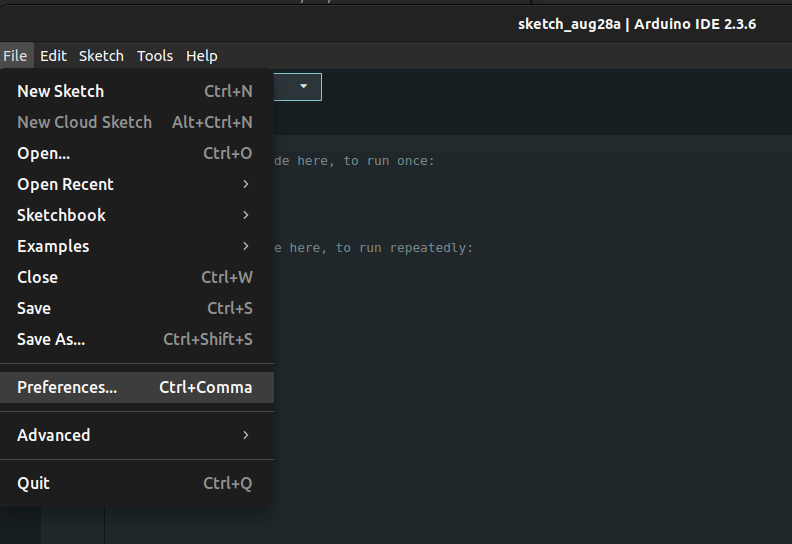

# Lab Session 0: Initial steps

**Estimated time:** 1.5h (1 session)

## 1. Microcontrollers simulation

### Launch an example

- Access the Wokwi simulation environment via [this link](https://wokwi.com/).
- Select the ESP32 template.
  
    
    

    !!! warning
        Open the ESP32 template from `Starter Templates`, not from `ESP-IDF Templates`. The former is based on the Arduino IDE while the latter is based on the ESP-IDF environment that will not be used in the course.

- Simulate the example sketch:
  
    ```Arduino
    void setup() {
    // put your setup code here, to run once:
    Serial.begin(115200);
    Serial.println("Hello, ESP32!");
    }

    void loop() {
    // put your main code here, to run repeatedly:
    delay(10); // this speeds up the simulation
    }
    ```

    !!! warning
        Here you are *simulating* the behavior of the system including the code, you are not *compiling* the code (i.e., we're not generating the machine-readable code that will be executed by a processor). But the code MUST be compliable (i.e., it will be verified to check that I would compile )

    !!! info
        - Note that the real-time factor at the top right corner should be as close as possible to 100%. This value is a simulation performance metric. The closer it gets to 100%, the better is the simulation. A value of 100% means the simulation is running in real-time. If the value drops, the times in the simulation are no longer reliable.
        - Note the instruction `delay(10); // this speeds up the simulation`. Try to comment this line and see what happens. What if you put `delay(1);` or `delay(5);`?

    !!! question
        - What is the purpose of the [`setup()`](https://docs.arduino.cc/language-reference/en/structure/sketch/setup/) function?
        - What is the purpose of the [`loop()`](https://docs.arduino.cc/language-reference/en/structure/sketch/loop/) function?
        - What does the [`delay()`](https://docs.arduino.cc/language-reference/en/functions/time/delay/) function do?
        - Why do we need to put the `delay(10)` inside the `loop()` function?

### Add hardware components

- First of all, check the `diagram.json` file . What information do you see there?

- Connect an LED to `GPIO 21` with a resistor, as shown in the diagram (rotate - ++r++ and flip - ++p++ components if necessary).

    

    !!! question
        - Check again the `diagram.json`. What happened? Can you change the color of the LED to *green* from this file?
        - What do you think you can do with the *Library Manager*?

## 2. Prepare the Arduino IDE

Follow the installation steps described in this guide.

1. Install Arduino IDE: Download it from [this link](https://www.arduino.cc/en/software/).
2. Install the M5Stack board family:

    

    You need to copy/paste this text to download the board package

    ```txt
    https://static-cdn.m5stack.com/resource/arduino/package_m5stack_index.json 
    ```

    

    Once the board package address is set, you can install it from the *boards manager*.
    

    !!! info
        This process may take a few minutes.

    Once installed, you can select M5Core2 from the board selection menu.

    

3. Install the Arduino libraries for M5Core2:

    

    !!! warning
        When you press *Install*, you'll see the list of dependencies. You *MUST* install all the dependencies too.
    !!! info
        This is a long process that may take several minutes. Be patient...
    !!! Tip
        In case the list of dependencies is that large that you cannot see the *Install All* button, you can press the tab key ++tab++ twice to put the cursor over the button and then press ++enter++ to install all the dependencies.

4. Install the CP2104 driver (USB driver):

    Download it from [this link](https://m5stack.oss-cn-shenzhen.aliyuncs.com/resource/drivers/CP210x_VCP_Windows.zip) if you're using Windows, from [this link](https://m5stack.oss-cn-shenzhen.aliyuncs.com/resource/drivers/CP210x_VCP_MacOS.zip) if you're using MacOS, or from [this other link](https://m5stack.oss-cn-shenzhen.aliyuncs.com/resource/drivers/CP210x_VCP_Linux.zip) if you're using Linux.

    More info about USB driver installation [here](https://docs.m5stack.com/en/arduino/m5core2/program#2.usb%20driver%20installation).

    Now, when you connect the M5Core2 devide to the PC with the USB cable, you can select the port in the Arduino IDE.

    

    !!! info
        - In windows, the port is called *COMX*, where *X* is a number that can vary from time to time, e.g., *COM5*.
        - In linux, the port is called "ttyUSBX" or "ttyACMX", where *X* is a number that can vary from time to time, e.g., *ttyUSB2*.

5. Compile and upload the `hello_world.ino` example from *M5Core2* library:

    

    You can press the *Upload* (in red) button to compile and load the program to the device. Note that the button on the left (*Verify* - in green) compiles the program but doesn't upload it to the device.

    

6. *OPTIONAL (do it* **ONLY if you have finished all the exercises** *of the lab session):* You can open other examples if you want to see the potential of M5Core2. You can try this one:

    


!!! tip "Additional resources"
    [Here](https://docs.m5stack.com/en/core/core2) you can find more documentation about some of the basic functions of M5Core2.  

**Pinout and Important Notes**
Below is the M5Core2 pinout. The pins marked in red are the ones we will use in the exercises.


!!! warning
    - Some *pins* on the M5Core2 are preconfigured, so pay attention when connecting external components.
    - The ESP32 inside the M5Core2 has 3 serial ports:
          - `Serial1` is reserved for the display (do not use it).
          - `Serial0` can be configured (pins `G3 – RXD0` and `G1 – TXD0`), but it is reserved for USB connection to the PC.
          - `Serial2` is free and can be configured (pins `G13 – RXD2` and `G14 – TXD2`) as regular GPIO using `pinMode()`.
