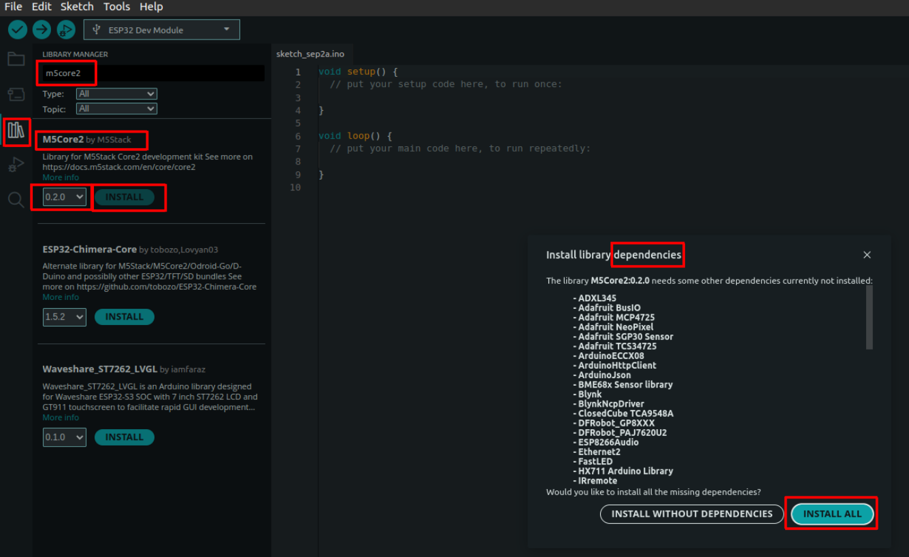
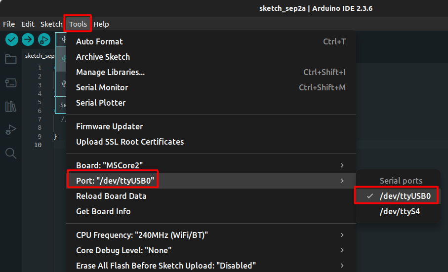
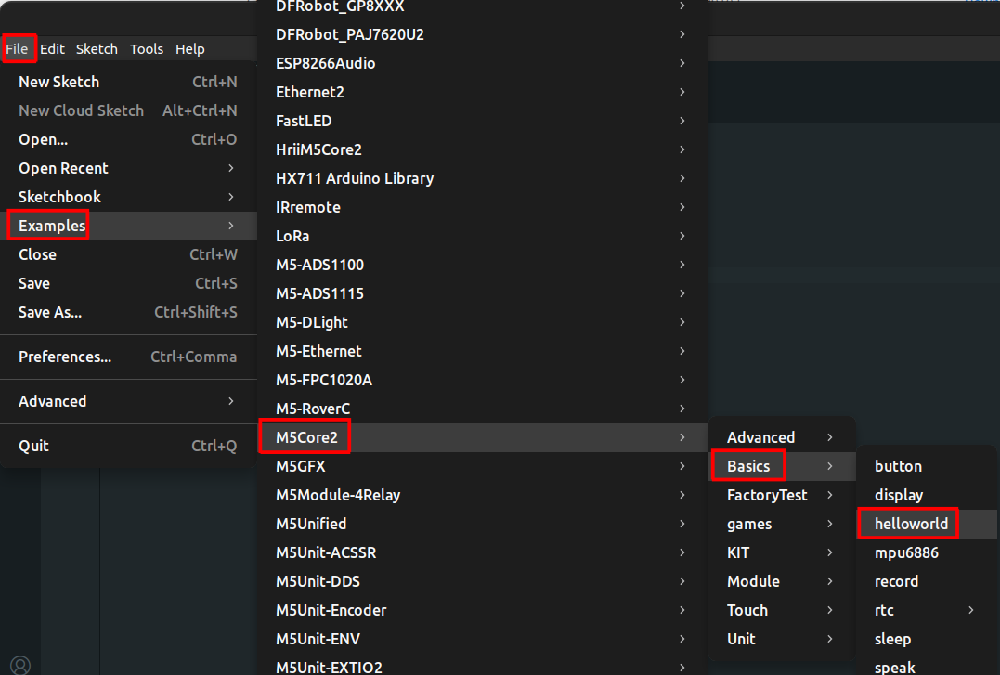

# Lab Session 1: Microcontrollers programming

**Estimated time:** 1.5h (1 session)

## 1. Prepare the Arduino IDE

Follow the installation steps described in this guide.

1. Install Arduino IDE: Download it from [this link](https://www.arduino.cc/en/software/).
2. Install the M5Stack board family:

    

    You need to copy/paste this text to download the board package

    ```txt
    https://static-cdn.m5stack.com/resource/arduino/package_m5stack_index.json 
    ```

    

    Once the board package address is set, you can install it from the *boards manager*.
    

    !!! info
        This process may take a few minutes.

    Once installed, you can select M5Core2 from the board selection menu.

    

3. Install the Arduino libraries for M5Core2:

    

    !!! warning
        When you press *Install*, you'll see the list of dependencies. You *MUST* install all the dependencies too. 
    !!! info
        This is a long process that may take several minutes. Be patient...
    !!! Tip
        In case the list of dependencies is that large that you cannot see the *Install All* button, you can press the tab key ++tab++ twice to put the cursor over the button and then press ++enter++ to install all the dependencies 
   
4. Install the CP2104 driver (USB driver):

    Download it from [this link](https://m5stack.oss-cn-shenzhen.aliyuncs.com/resource/drivers/CP210x_VCP_Windows.zip) if you're using Windows, from [this link](https://m5stack.oss-cn-shenzhen.aliyuncs.com/resource/drivers/CP210x_VCP_MacOS.zip) if you're using MacOS, or from [this other link](https://m5stack.oss-cn-shenzhen.aliyuncs.com/resource/drivers/CP210x_VCP_Linux.zip) if you're using Linux.

    More info about USB driver installation [here](https://docs.m5stack.com/en/arduino/m5core2/program#2.usb%20driver%20installation).

    Now, when you connect the M5Core2 devide to the PC with the USB cable, you can select the port in the Arduino IDE.

    

    !!! info
        - In windows, the port is called *COMX*, where *X* is a number that can vary from time to time, e.g., *COM5*.
        - In linux, the port is called "ttyUSBX" or "ttyACMX", where *X* is a number that can vary from time to time, e.g., *ttyUSB2*.

5. Compile and upload the ```hello_world.ino``` example from *M5Core2* library:

    

    You can press the *Upload* (in red) button to compile and load the program to the device. Note that the button on the left (*Verify* - in green) compiles the program but doesn't upload it to the device.

    

6. *OPTIONAL (do it* **ONLY if you have finished all the exercises** *of the lab session):* You can open other examples if you want to see the potential of M5Core2. You can try this one:

    


!!! tip "Additional resources"
    [Here]([http://docs.m5](https://docs.m5stack.com/en/core/core2)) you can find more documentation about some of the basic functions of M5Core2.  

**Pinout and Important Notes**
Below is the M5Core2 pinout. The pins marked in red are the ones we will use in the exercises.


!!! warning
    - Some *pins* on the M5Core2 are preconfigured, so pay attention when connecting external components.
    - The ESP32 inside the M5Core2 has 3 serial ports:
          - ```Serial1``` is reserved for the display (do not use it).
          - ```Serial0``` can be configured (pins G3 – RXD0 and G1 – TXD0), but it is reserved for USB connection to the PC.
          - ```Serial2``` is free and can be configured (pins G13 – RXD2 and G14 – TXD2) as regular GPIO using pinMode().

## 2. Turn an LED ON and OFF
Connect an LED as follows:


Run the following program:
```Arduino
#include <M5Core2.h>
#define LED_PIN 14

void setup() {
  M5.begin(); // Initialize M5Core2
  pinMode(LED_PIN, OUTPUT);
}

void loop() {
  digitalWrite(LED_PIN, HIGH);
  delay(500);
  digitalWrite(LED_PIN, LOW);
  delay(500);
}
```

!!! question
    Note that you had to include the ```#include <M5Core2.h>``` and the ```M5.begin(); // Initialize M5Core```
    Why did you have to do that? what are these instructions for?


## 3. Additional exercises

### 3.1. Blink at a certain frequency

- Using the same circuit as in the previous exercise, write a script that Blinks the LED at a frequency of 10Hz.

    !!! question
        - For how long does the LED has to be ON or OFF in each cycle?

### 3.2. Blink and stop

- Using the same circuit as in the previous exercise, write a script that Blinks the LED at a frequency of 2Hz and stops the blinking after 5 seconds.

    !!! question
        - How many times does the LED blink?
        - What is the final state of the LED when the blink stops, does it remain ON or OFF?

    !!! tip
        You may need to use the [```for```](https://docs.arduino.cc/language-reference/en/structure/control-structure/for/) loop, or the  [```if...else```](https://docs.arduino.cc/language-reference/en/structure/control-structure/else/) condition.