# Use Wokwi in VSCode (local)

This page explains how to use Wokwi inside [Visual Studio Code](https://code.visualstudio.com/). 

## Why do you want to use Wokwi inside VS Code?

When using Wokwi in the browser you may have noticed some delays when compiling the project.

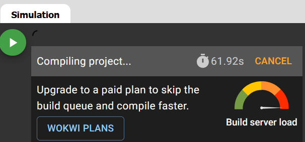

This is because everytime a user press the *Start simulation* button, the code has to be, first compiled (the user sends a compilation request when pressing the button), and then simulated. Compiling code takes some time (especially for large codes or when using several libraries). Hence, the compilation request gets queued and waits to be attended by the Wokwi server to get the compilation done. If the server is very busy (i.e., many requests with high amounts of code occurring at the same time), your compilation request may be queued for long time even though your code takes very short time to be compiled, and you experience high delays.

If you use Wokwi in VS Code, you'll still use Wokwi server to simulate your code (i.e., you need internet connection as the simulation won't run in your local machine), but you'll compile your code in your local machine and tell Wokwi where are the binaries to be used for the simulation. This way you'll skip the main reason of the delays: the compilation request queue.

## Installation

You have to do the following:

1. Install VS Code:
    - You can download it from [here](https://code.visualstudio.com/download).
2. Install the Wokwi for VS Code extension:
    - You can install it directly from the *Extensions* panel inside VS Code (recommended).

    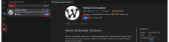
    
    - You can also install it from [here](https://marketplace.visualstudio.com/items?itemName=wokwi.wokwi-vscode).

3. Install the Arduino Community Edition for VS Code extension:

    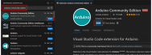

## Wokwi license

Wokwi is free, but to use it locally in your machine you need a licence. If you don't want (or can't) pay for it, you can use the 30-days free license. Don't worry, after these 30 days you can renovate the free license again. 

To get your license you need to do the following:

1. First, you need to create a Wokwi account. You can do this from the browser.
2. Open VS Code, press F1 (to open the command palette)  and write `Wokwi: Request a New License`.

    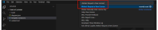

3. When you get the following message click on `Open`.

    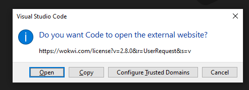

4. When the new tab is open in your browser, click on `Get your license`.

    

5. VS Code will show you the following message. Select `Do not ask me again` and click on `Open`. Now, your wokwi license is activated in VS Code and will expire after 30 days.

    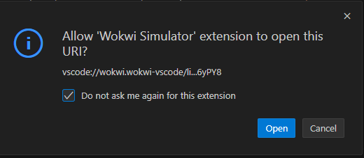

!!! failure
    If VS Code does not automatically detect your license key in step 4, you can copy the key (the super long alphanumeric chain ) and press F1 in VS Code, then type `Wokwi: Manually Enter License Key`, and paste the key there

!!! info
    When your license expires, you can repeat this process and get another 30-days free license.

## Create your Wokwi project in VS Code

As you may already know, when using Wokwi in the browser you need, at least, two files. These files are `sketch.ino` and the `diagram.json`. To use Wokwi in VS Code you'll need some more files. 

1. First, create your project in your local computer. You can do this by hand or you can [download a template here](other/template_wokwi.zip). If you download that template, you need to unzip it.

2. Open your project from VS Code

    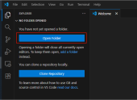

3. Once the project is open, you should see the following:

    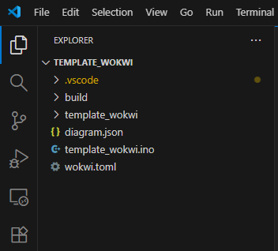

    - **build**: This is an empty folder at this moment. Here is where the binaries will be storage when you compile your code.
    - **diagram.json**: This is the same `diagram.json` as the one in the browser version. I.e., the definition of the system components and connections.

        !!! tip
            The best way to edit this file is to use thw GUI in the browser. I.e., create your diagram in the browser  app, copy the code inside the `diagram.json` and then go to your local project in VS Code and paste it there. This is because you don't have the GUI in VS Code (you can only edit the text).
        
        !!! warning
            It might happen that if you double-click this file aiming at editing it, you'll see the diagram instead of the code. If you press with the right-click on top of the file name and click on *Open with* and then *Text editor* you'll be able to see the code.

            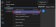

            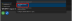

    - **template_wokwi.ino**: This is the same as the `sketch.ino` in the browser. I.e., your arduino code.
    - **wokwi.toml**: This file contains the path of the binary files that wokwi needs to start the simulation. I.e., where the binaries after the compilation will go. If you open this file you will see the following:

        ```toml
        [wokwi]
        version = 1
        firmware='build/template_wokwi.ino.bin'
        elf='build/template_wokwi.ino.elf'
        ```
    
    !!! danger
        - As you may notice, this project is called `template_wokwi`. It is critical that the name of the project is the same as the name of the `.ino` file, and the one inside the `toml` file. 
        - Hence, if your project is called `project_test`, then you should have the following:

        ```txt
        project_test
            |
            |── build
            |── diagram.json
            |── project_test.ino
            └── wokwi.toml
        ```

        - And inside the `.toml` you should have:

        ```toml
        [wokwi]
        version = 1
        firmware='build/project_test.ino.bin'
        elf='build/project_test.ino.elf'
        ``` 

## Compile your project

To start the simulation, the project must be previously compiled. To do this you first must install the boards we're using in wokwi (ESP32), tell VS Code the board you want to compile the code for, and compile the code inside the build folder

1. Install the ESP32 boards. 

    - Press F1 and type `Arduino: Board Manager`.

        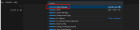

    - Install the ESP32 board of Espressif.

        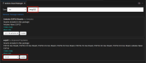

        !!! warnig
            Remember to install the correct version! In the picture above the version selected is 3.2.0, meaning that it'll compile using the version 3 of the Espressif API. If you're using code of version 2, you must select a 2.X version (e.g., 2.0.17). [Check this website for more info](https://jmgandarias.com/industrial_informatics/microcontrollers_programming/arduino_esp32_core/).

2. Change the target board to compile the code.

    - Press F1 and type `Arduino: Change Board Type`.

        

    - Select the `ESP32 Dev Module` board.

        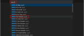

3. After doing this you'll notice that a new file inside a hidden folder (hidden files and folers starts with `.`, here the folder `.vscode` is a hidden folder) has been created in your project `.vscode/arduino.json`. This is a configuration file that tells VS Code which board are you compiling for and where the binaries will be saved after the compilation.

    - Originally this file looks like this:
    ```json
    {
        "configuration": "JTAGAdapter=default,PSRAM=disabled,PartitionScheme=default,CPUFreq=240,FlashMode=qio,FlashFreq=80,FlashSize=4M,UploadSpeed=921600,LoopCore=1,EventsCore=1,DebugLevel=none,EraseFlash=none",
        "board": "esp32:esp32:esp32"
    }
    ```
    - You must change it and write the following:
    ```json
    {
        "board": "esp32:esp32:esp32",
        "sketch": "template_wokwi.ino",
        "output": "build"
    }
    ```

    !!! warning
        Notice that here you're telling VS Code that you're going to compile for the `esp32` board, that the sketch you want to compile is `template_wokwi.ino` (note that if you have changed the name of the project, you must change it here too), and that the output binaries will be saved in the folder `build`.

4. Once you have done this, you can compile your project.
    - Press F1 and type `Arduino: Verify`. This will compile the code. Hence, if there's any compilation error, you'll be abole to see it in the VS Code terminal.

    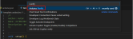

    - Once the compilation is done, you should be able to see a bunch of new files inside the previously-empty `build` folder. Notice that you have the files `template_wokwi.ino.bin` and `template_wokwi.ino.elf`

    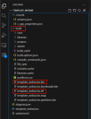

## Simulate your project

Once your project is correctly compiled, you can double-click on `diagram.json` and start the simulation.

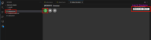

!!! warning
    If you simulate a project, and then make changes in the code, you must compile it again. It may happen to you that after doing this, when you press start the simulation again, you don't see the last changes you have made.

    This is because everytime you want to change somenthing in your code **you must close** the simulation window, compile the code with `Arduino: Verify`, and re-open the simulation window. If you don't close and open the simulation window you very probably won't see the effects.

## Full example

You can download a [full example here](other/ejemplo_timer_builder-2.zip).

The result of the simulation are shown in this video (note that when you open the `diagram.json` it will compile the code - it is shown in the video):


## Troubleshooting

1. Project name
    One of the most common errors happen when you want to change the name of the project after compiling a couple of times.
    As you may have noticed during this guide, Wokwi for VS Code is **extremely sensitive** to the project name. This means you must be extremely careful when changing it. 

    If you want to change the project name after compiling it, my suggestion is to do the following:

    1. Delete every file inside the build folder (previous compiled code).
    2. Delete the `.vscode/c_cpp_properties.json` file.
    3. Change the name of the project folder.
    4. Change the name of the `.ino` file.
    5. Change the name of the sketch inside the `.vscode/arduino.json` file.
    6. Change the name of the `firmware` and `elf` inside the `wokwi.toml` file.


You can find an updated guide [here](https://docs.Wokwi.com/vscode/getting-started).
