Informática Industrial  
Grado en Ingeniería Electrónica Industrial  
Universidad de Málaga  
[Juan M. Gandarias](https://jmgandarias.com)  
[jmgandarias@uma.es](mailto:jmgandarias@uma.es)

# Usar Wokwi en VSCode (local)

Esta página explica cómo usar Wokwi dentro de [Visual Studio Code](https://code.visualstudio.com/).

## ¿Por qué usar Wokwi dentro de VS Code?

Al usar Wokwi en el navegador, puede que hayas notado algunos retrasos al compilar el proyecto.

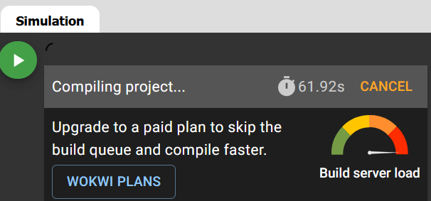

Esto ocurre porque cada vez que un usuario pulsa el botón *Start simulation*, primero hay que compilar el código (la pulsación envía una solicitud de compilación) y después simular. Compilar código lleva tiempo (especialmente con códigos grandes o cuando se usan varias librerías). Por tanto, la solicitud de compilación entra en cola y espera a que el servidor de Wokwi la atienda. Si el servidor está muy ocupado (es decir, hay muchas solicitudes con gran cantidad de código al mismo tiempo), tu solicitud puede quedar en cola durante bastante tiempo aunque tu código tarde muy poco en compilarse, y por eso experimentas retrasos elevados.

Si usas Wokwi en VS Code, seguirás usando el servidor de Wokwi para simular tu código (es decir, necesitas conexión a internet, porque la simulación no se ejecuta en tu máquina local), pero compilarás el código en tu ordenador y le indicarás a Wokwi dónde están los binarios para la simulación. Así evitas la principal causa de los retrasos: la cola de solicitudes de compilación.

## Instalación

Debes hacer lo siguiente:

1. Instalar VS Code:
    - Puedes descargarlo desde [aquí](https://code.visualstudio.com/download).
2. Instalar la extensión Wokwi for VS Code:
    - Puedes instalarla directamente desde el panel *Extensions* dentro de VS Code (recomendado).

    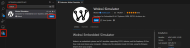

    - También puedes instalarla desde [aquí](https://marketplace.visualstudio.com/items?itemName=wokwi.wokwi-vscode).

3. Instalar la extensión Arduino Community Edition for VS Code:

    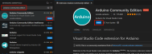

## Licencia de Wokwi

Wokwi es gratuito, pero para usarlo en local en tu máquina necesitas una licencia. Si no quieres (o no puedes) pagarla, puedes usar la licencia gratuita de 30 días. No te preocupes, pasados esos 30 días puedes renovar otra vez la licencia gratuita.

Para obtener tu licencia debes hacer lo siguiente:

1. Primero, crea una cuenta en Wokwi. Puedes hacerlo desde el navegador.
2. Abre VS Code, pulsa F1 (para abrir la paleta de comandos) y escribe `Wokwi: Request a New License`.

    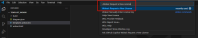

3. Cuando aparezca el siguiente mensaje, haz clic en `Open`.

    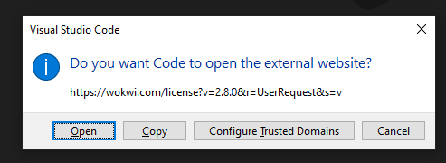

4. Cuando se abra la nueva pestaña en tu navegador, haz clic en `Get your license`.

    

5. VS Code te mostrará el siguiente mensaje. Selecciona `Do not ask me again` y haz clic en `Open`. Tu licencia de Wokwi quedará activada en VS Code y caducará en 30 días.

    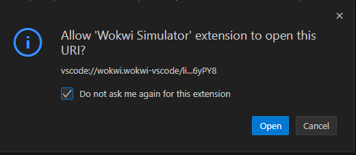

::: failure
Si VS Code no detecta automáticamente tu clave de licencia en el paso 4, puedes copiar la clave (la cadena alfanumérica muy larga), pulsar F1 en VS Code, escribir `Wokwi: Manually Enter License Key`, y pegar ahí la clave.
:::

::: info
Cuando caduque tu licencia, puedes repetir este proceso y conseguir otra licencia gratuita de 30 días.
:::

## Crea tu proyecto Wokwi en VS Code

Como ya sabrás, al usar Wokwi en el navegador necesitas, al menos, dos archivos: `sketch.ino` y `diagram.json`. Para usar Wokwi en VS Code necesitarás algunos archivos más.

1. Primero, crea tu proyecto en tu ordenador local. Puedes hacerlo a mano o puedes [descargar una plantilla aquí](other/template_wokwi.zip). Si descargas esa plantilla, debes descomprimirla.

2. Abre tu proyecto desde VS Code.

    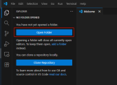

3. Una vez abierto el proyecto, deberías ver lo siguiente:

    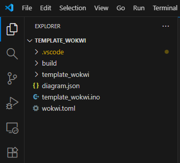

    - **build**: Esta carpeta está vacía en este momento. Aquí se guardarán los binarios cuando compiles el código.
    - **diagram.json**: Es el mismo `diagram.json` que en la versión de navegador. Es decir, la definición de los componentes y conexiones del sistema.

        ::: tip
        La mejor forma de editar este archivo es usar la GUI en el navegador. Es decir, crea tu diagrama en la app del navegador, copia el contenido del `diagram.json`, luego ve a tu proyecto local en VS Code y pégalo allí. Esto es así porque en VS Code no tienes la GUI (solo puedes editar texto).
        :::

        ::: warning
        Puede pasar que, si haces doble clic en este archivo para editarlo, veas el diagrama en lugar del código. Si haces clic derecho sobre el nombre del archivo y pulsas *Open with* y después *Text editor*, podrás ver el código.

        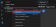

        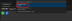

    - **template_wokwi.ino**: Es equivalente al `sketch.ino` del navegador. Es decir, tu código de Arduino.
    - **wokwi.toml**: Este archivo contiene la ruta de los binarios que Wokwi necesita para iniciar la simulación. Es decir, dónde se guardarán los binarios después de compilar. Si abres este archivo verás lo siguiente:

        ```toml
        [wokwi]
        version = 1
        firmware='build/template_wokwi.ino.bin'
        elf='build/template_wokwi.ino.elf'
        ```

    ::: danger
    - Como puedes ver, este proyecto se llama `template_wokwi`. Es fundamental que el nombre del proyecto sea el mismo que el del archivo `.ino` y el que aparece dentro del archivo `toml`.
    - Por tanto, si tu proyecto se llama `project_test`, deberías tener lo siguiente:

    ```txt
    project_test
        |
        |── build
        |── diagram.json
        |── project_test.ino
        └── wokwi.toml
    ```

    - Y dentro del `.toml` deberías tener:

    ```toml
    [wokwi]
    version = 1
    firmware='build/project_test.ino.bin'
    elf='build/project_test.ino.elf'
    ```
    :::

## Compila tu proyecto

Para iniciar la simulación, el proyecto debe compilarse previamente. Para ello, primero debes instalar las placas que usamos en Wokwi (ESP32), indicar en VS Code para qué placa quieres compilar y compilar el código en la carpeta `build`.

1. Instala las placas ESP32.

    - Pulsa F1 y escribe `Arduino: Board Manager`.

        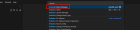

    - Instala la placa ESP32 de Espressif.

        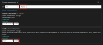

        ::: warning
        Recuerda instalar la versión correcta. En la imagen superior, la versión seleccionada es la 3.2.0, lo que significa que compilará usando la versión 3 de la API de Espressif. Si estás usando código de la versión 2, debes seleccionar una versión 2.X (por ejemplo, 2.0.17). [Consulta este sitio para más información](https://jmgandarias.com/industrial_informatics/microcontrollers_programming/arduino_esp32_core/).
        :::

2. Cambia la placa de destino para compilar el código.

    - Pulsa F1 y escribe `Arduino: Change Board Type`.

        

    - Selecciona la placa `ESP32 Dev Module`.

        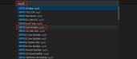

3. Después de hacer esto, notarás que se ha creado un archivo nuevo dentro de una carpeta oculta (los archivos y carpetas ocultos empiezan por `.`, aquí la carpeta `.vscode` es oculta): `.vscode/arduino.json`. Este es un archivo de configuración que le dice a VS Code para qué placa estás compilando y dónde se guardarán los binarios tras la compilación.

    - Originalmente este archivo se ve así:
    ```json
    {  
        "configuration": "JTAGAdapter=default, PSRAM=disabled, PartitionScheme=default, CPUFreq=240, FlashMode=qio, FlashFreq=80, FlashSize=4M, UploadSpeed=921600, LoopCore=1, EventsCore=1, DebugLevel=none, EraseFlash=none",
        "board": "esp32:esp32:esp32"
    }
    ```
    - Debes cambiarlo y dejarlo así:
    ```json
    {  
        "board": "esp32:esp32:esp32",
        "sketch": "template_wokwi.ino",
        "output": "build"
    }
    ```

    ::: warning
    Observa que aquí le estás diciendo a VS Code que vas a compilar para la placa `esp32`, que el sketch a compilar es `template_wokwi.ino` (ten en cuenta que si has cambiado el nombre del proyecto, debes cambiarlo aquí también), y que los binarios de salida se guardarán en la carpeta `build`.
    :::

4. Una vez hecho esto, ya puedes compilar tu proyecto.
    - Pulsa F1 y escribe `Arduino: Verify`. Esto compilará el código. Por tanto, si hay algún error de compilación, podrás verlo en el terminal de VS Code.

    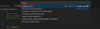

    - Una vez termine la compilación, deberías ver varios archivos nuevos dentro de la carpeta `build`, que antes estaba vacía. Observa que aparecen los archivos `template_wokwi.ino.bin` y `template_wokwi.ino.elf`.

    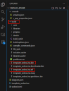

## Simula tu proyecto

Cuando tu proyecto esté compilado correctamente, puedes hacer doble clic en `diagram.json` e iniciar la simulación.

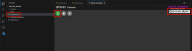

::: warning
Si simulas un proyecto y luego haces cambios en el código, debes compilar otra vez. Puede ocurrir que, después de hacerlo, al volver a pulsar iniciar simulación, no veas los últimos cambios.

Esto pasa porque cada vez que quieras cambiar algo en tu código **debes cerrar** la ventana de simulación, compilar con `Arduino: Verify`, y volver a abrir la ventana de simulación. Si no cierras y vuelves a abrir la simulación, es muy probable que no veas los efectos.
:::

## Ejemplo completo

Puedes descargar un [ejemplo completo aquí](https://jmgandarias.com/industrial_informatics/intro/wokwi_local/other/ejemplo_timer_builder-2.zip).

El resultado de la simulación se muestra en [este vídeo](https://jmgandarias.com/industrial_informatics/intro/wokwi_local/videos/wokwi_local_demo.mp4) (ten en cuenta que al abrir `diagram.json` se compilará el código).

## Resolución de problemas

1. Nombre del proyecto
    Uno de los errores más comunes ocurre cuando quieres cambiar el nombre del proyecto después de haber compilado un par de veces.
    Como habrás visto en esta guía, Wokwi para VS Code es **extremadamente sensible** al nombre del proyecto. Esto significa que debes tener mucho cuidado al cambiarlo.

    Si quieres cambiar el nombre del proyecto después de compilarlo, mi sugerencia es hacer lo siguiente:

    1. Borra todos los archivos dentro de la carpeta `build` (código compilado previamente).
    2. Borra el archivo `.vscode/c_cpp_properties.json`.
    3. Cambia el nombre de la carpeta del proyecto.
    4. Cambia el nombre del archivo `.ino`.
    5. Cambia el nombre del sketch dentro del archivo `.vscode/arduino.json`.
    6. Cambia el nombre de `firmware` y `elf` dentro del archivo `wokwi.toml`.


Puedes encontrar una guía actualizada [aquí](https://docs.Wokwi.com/vscode/getting-started).
