Informática Industrial  
Grado en Ingeniería Electrónica Industrial  
Universidad de Málaga  
[Juan M. Gandarias](https://jmgandarias.com)  
[Carlos J. Pérez del Pulgar](https://www.uma.es/isa/info/76432/cperez/)

# Sesión de laboratorio 1: Introducción a la programación de microcontroladores

**Tiempo estimado:** 1,5 horas (1 sesión)

## Descripción

El objetivo de esta sesión es introducir los conceptos básicos de la programación de microcontroladores y del control del tiempo. Aprenderemos a configurar pines digitales, a utilizar la estructura de un programa en Arduino (`setup()` y `loop()`) y a controlar LED y pulsadores mediante funciones como `delay()` y `millis()`.

## 1. Trabajar con hardware real

### 1.1. Preparar el entorno de Arduino IDE

Sigue los pasos de instalación descritos en esta guía.

::: note
Ten en cuenta que solo necesitas completar estos pasos una vez y únicamente en tu propio ordenador. Si vas a utilizar el PC del departamento, no necesitas seguir estos pasos.
:::

1. Instala Arduino IDE descargándolo desde [este enlace](https://www.arduino.cc/en/software/).
2. Instala la familia de placas M5Stack:

    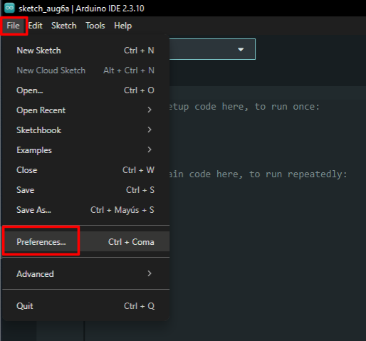

    Necesitas copiar y pegar el siguiente texto para añadir la URL del paquete de la placa:

    ```txt
    https://static-cdn.m5stack.com/resource/arduino/package_m5stack_index.json
    ```

    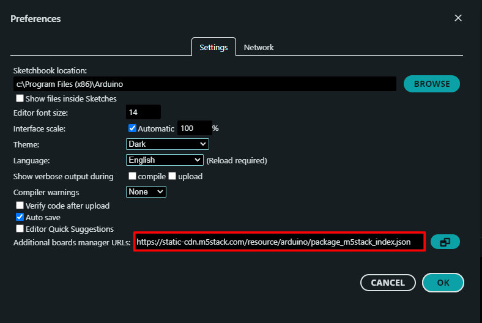

    Una vez configurada la URL del paquete de la placa, puedes instalarlo desde el Gestor de placas.

    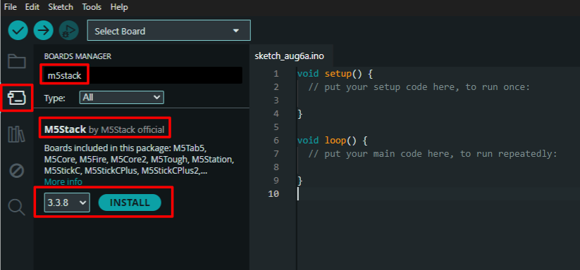

    ::: tip
    Puedes encontrar instrucciones actualizadas para la instalación de M5Core2 [aquí](https://docs.m5stack.com/en/arduino/m5core2/program).
    :::

    ::: warning
    Ten en cuenta las actualizaciones recientes de la librería ESP32 Core para Arduino. En 2024, el núcleo Arduino-ESP32 se actualizó desde la versión 2.x (basada en ESP-IDF 4.4) a la versión 3.x (basada en ESP-IDF 5.1). La API subyacente y el sistema de compilación cambiaron algunos comportamientos. Gran parte del código que puedes encontrar en Internet se escribió para la versión anterior, la 2.x. Todas las sesiones de laboratorio y los programas de este curso se han actualizado a la versión más reciente. Puedes encontrar más información sobre las versiones 2.x y 3.x [aquí](../arduino_esp32_core).
    :::

    Una vez instalado, puedes seleccionar M5Core2 en el menú de selección de placas.

    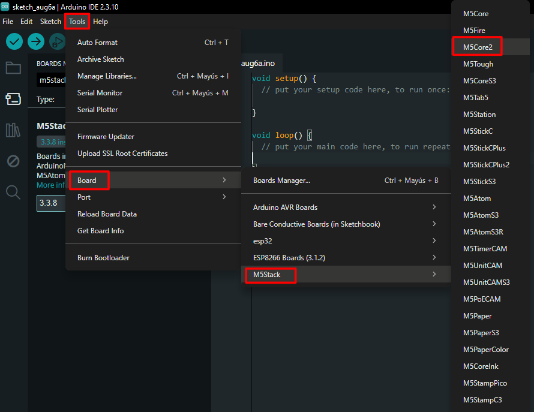

3. Instala las librerías de Arduino para M5Core2:

    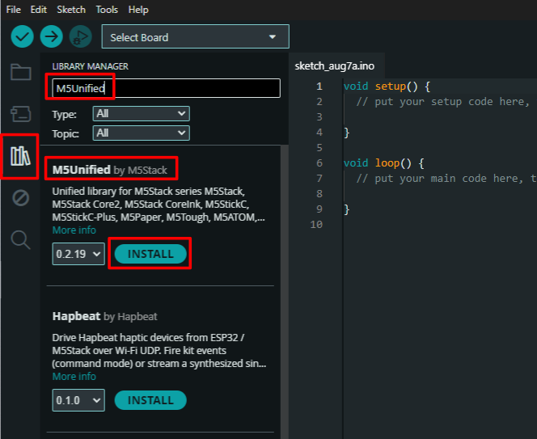

    ::: warning
    Cuando pulses *Install*, verás una lista de dependencias. Debes instalarlas todas.
    :::

    ::: danger
    Si durante la instalación aparece el siguiente error, significa que no tienes permiso de escritura en la carpeta de librerías:

    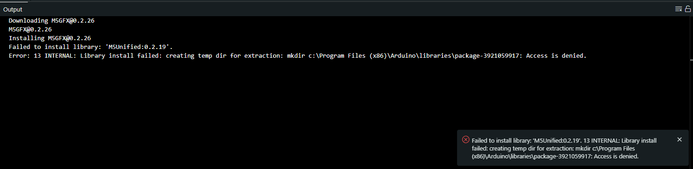

    Puedes resolver este problema de una de estas dos formas:

    1. Abre Arduino IDE como administrador:

        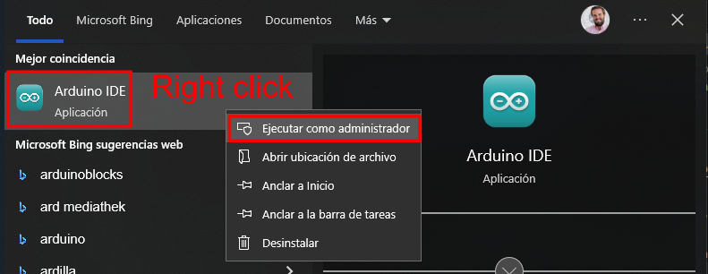

    2. Cambia la carpeta de librerías a una ubicación donde tengas permisos de escritura:

        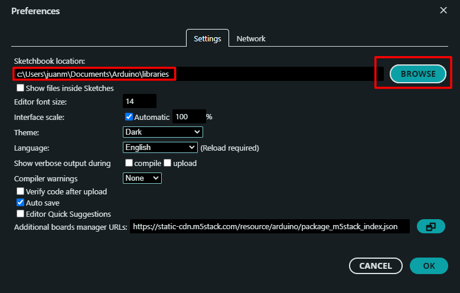
    :::

4. Instala el controlador USB CP2104:

    Descárgalo desde uno de los siguientes enlaces:
    - [Windows](https://m5stack.oss-cn-shenzhen.aliyuncs.com/resource/drivers/CP210x_VCP_Windows.zip) (Descomprime el archivo y ejecuta `CP210xVCPInstaller_Win7_v5.40.24.exe`).
    - [macOS](https://m5stack.oss-cn-shenzhen.aliyuncs.com/resource/drivers/CP210x_VCP_MacOS.zip) (Descomprime el archivo y ejecuta `SiLabsUSBDriverDisk.dmg`).
    - [Linux](https://m5stack.oss-cn-shenzhen.aliyuncs.com/resource/drivers/CP210x_VCP_Linux.zip) (Descomprime el archivo y sigue las instrucciones de compilación de `CP210x_VCP_Linux_4.x_Release_Notes.txt`).

    Puedes encontrar más información sobre la instalación del controlador USB [aquí](https://docs.m5stack.com/en/arduino/m5core2/program#2.usb%20driver%20installation).

    Ahora, cuando conectes el M5Core2 al PC mediante el cable USB, podrás seleccionar el puerto en Arduino IDE.

    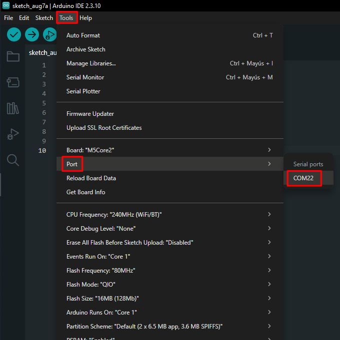

    ::: info
    - En Windows, el puerto se llama *COMX*, donde *X* es un número que puede variar, por ejemplo *COM5*.
    - En Linux, el puerto se llama *ttyUSBX* o *ttyACMX*, donde *X* es un número que puede variar, por ejemplo *ttyUSB2*.
    :::

    ::: warning
    Si ves varios dispositivos y no estás seguro de cuál es el M5Core2, puedes probar una de las siguientes opciones:

    1. Conecta y desconecta el dispositivo y comprueba cuál aparece y desaparece de la lista. Ten en cuenta que, para actualizar la lista de dispositivos conectados, debes cerrar y volver a abrir el menú `Tools` en Arduino IDE.
    2. Comprueba los dispositivos conectados en el Administrador de dispositivos:

        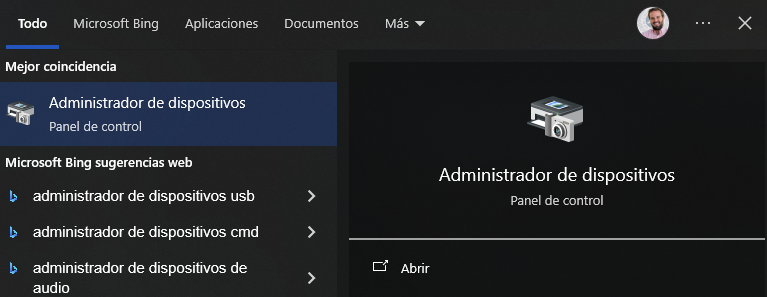

        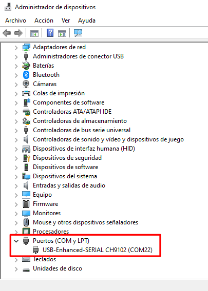
    :::

    ::: note
    También debes seleccionar la placa correcta, como en el paso 2. Recuerda que siempre debes comprobar la placa y el puerto antes de subir un programa al dispositivo.
    :::

5. Compila y sube el ejemplo `hello_world.ino`:

    ```Arduino
    #include <M5Unified.h>

    void setup() {

    // Inicializa M5Core2.
    M5.begin();

    // Escribe en la pantalla LCD.
    M5.Display.print("Hello World");

    }

    void loop() {
    }
    ```

    ::: note
    La primera vez que compiles un programa para M5Core2, puede tardar un poco.
    :::

    Puedes pulsar el botón *Upload* (en rojo) para compilar y cargar el programa en el dispositivo. Ten en cuenta que el botón *Verify* (en verde) compila el programa, pero no lo sube al dispositivo.

    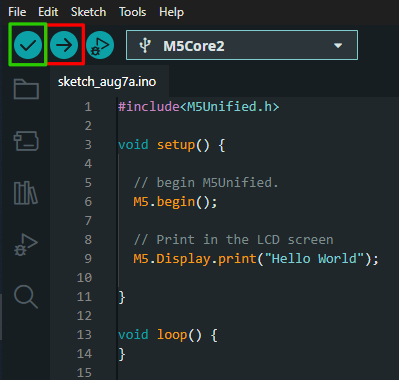

::: tip "Recursos adicionales"
Puedes encontrar más documentación sobre algunas de las funciones básicas de M5Core2 [aquí](https://docs.m5stack.com/en/core/core2).
:::

## Pinout y notas importantes
A continuación se muestra el pinout de M5Core2. Los pines marcados en rojo son los que usaremos en los ejercicios.

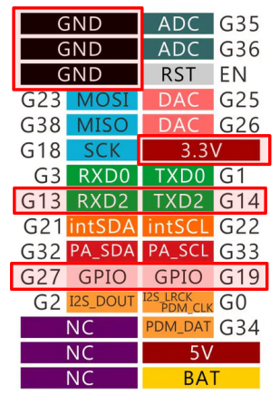

::: warning
- Algunos pines del M5Core2 están preconfigurados, así que presta atención al conectar componentes externos.
- El ESP32 integrado en M5Core2 tiene tres puertos serie:
        - `Serial1` está reservado para la pantalla (no lo uses).
        - `Serial0` se puede configurar (pines `G3 – RXD0` y `G1 – TXD0`), pero está reservado para la conexión USB al PC.
        - `Serial2` está libre y se puede configurar (pines `G13 – RXD2` y `G14 – TXD2`) como GPIO normal usando `pinMode()`.
:::

### 1.2. Encender y apagar un LED

Conecta un LED como se indica a continuación:

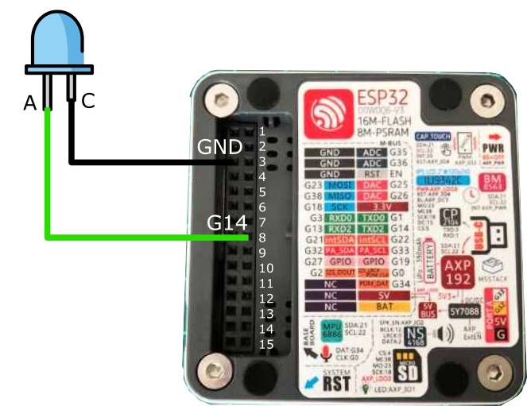

Ejecuta el siguiente programa:
```Arduino
#include<M5Unified.h>
#define LED_PIN 14

void setup() {
  M5.begin(); // Inicializa M5Core2
  pinMode(LED_PIN, OUTPUT);
}

void loop() {
  digitalWrite(LED_PIN, HIGH);
  delay(500);
  digitalWrite(LED_PIN, LOW);
  delay(500);
}
```

::: note
- ¿Qué hace la directiva [```#define```](https://docs.arduino.cc/language-reference/en/structure/further-syntax/define/)?
- ¿Qué hace la función [```pinMode()```](https://docs.arduino.cc/language-reference/en/functions/digital-io/pinMode/)?
- ¿Qué hace la función [```digitalWrite()```](https://docs.arduino.cc/language-reference/en/functions/digital-io/digitalwrite/)?
:::

::: note
Ten en cuenta que tuviste que incluir la línea ```#include <M5Unified.h>``` y la instrucción ```M5.begin(); // Initialize M5Core```.
¿Por qué necesitaste hacer eso? ¿Para qué sirven estas instrucciones?
:::

### 1.3. Ejercicios adicionales

#### 1.3.1. Parpadeo a una frecuencia determinada

    - Usando el mismo circuito que en el ejercicio anterior, escribe un programa que haga parpadear el LED a una frecuencia de 10 Hz.

    ::: note
    - ¿Durante cuánto tiempo debe estar el LED encendido o apagado en cada ciclo?
    :::

#### 1.3.2. Parpadeo y detenerse

    - Usando el mismo circuito que en el ejercicio anterior, escribe un programa que haga parpadear el LED a una frecuencia de 2 Hz y deje de parpadear después de 5 segundos.

    ::: note
    - ¿Cuántas veces parpadea el LED?
    - ¿Cuál es el estado final del LED cuando deja de parpadear: permanece encendido o apagado?
    :::

    ::: tip
    Puede que necesites usar el bucle [```for```](https://docs.arduino.cc/language-reference/en/structure/control-structure/for/) o la condición [```if...else```](https://docs.arduino.cc/language-reference/en/structure/control-structure/else/).
    :::

## 2. Trabajar en simulación

### 2.1. Simulación de microcontroladores

#### Lanzar un ejemplo

- Accede al entorno de simulación Wokwi a través de [este enlace](https://wokwi.com/).
- Selecciona la plantilla ESP32.

    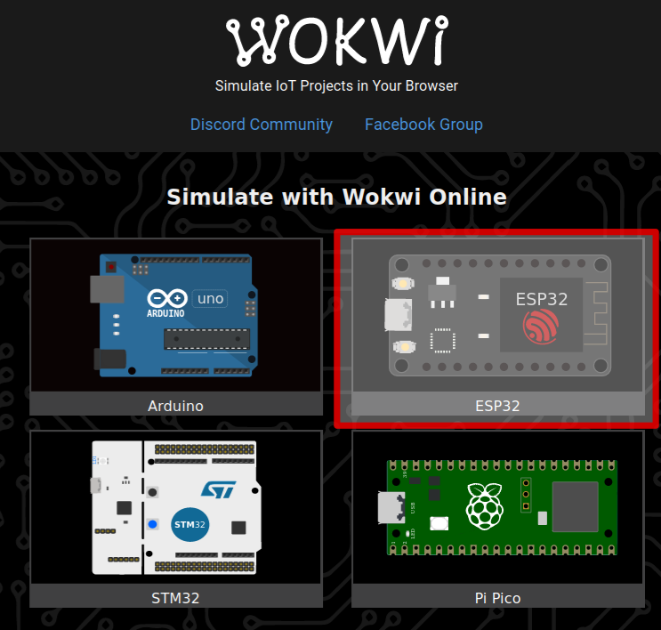
    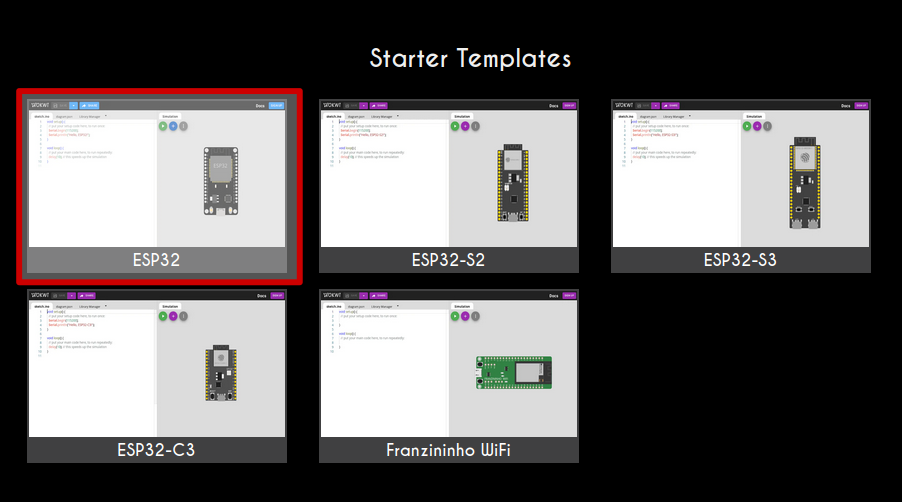

    ::: warning
    Abre la plantilla ESP32 desde `Starter Templates`, no desde `ESP-IDF Templates`. La primera está basada en Arduino IDE, mientras que la segunda está basada en el entorno ESP-IDF, que no se usará en este curso.
    :::

- Simula el programa de ejemplo:

    ```Arduino
    void setup() {
    // Pon tu código de configuración aquí, para ejecutarlo una vez:
    Serial.begin(115200);
    Serial.println("Hello, ESP32!");
    }

    void loop() {
    // Pon tu código principal aquí, para ejecutarlo repetidamente:
    delay(10); // Esto acelera la simulación.
    }
    ```

    ::: warning
    Aquí estás *simulando* el comportamiento del sistema. Wokwi compila el programa y ejecuta el código resultante en un modelo virtual del microcontrolador. Por tanto, el código debe ser compilable para que la simulación pueda ejecutarse.
    :::

    ::: info
    - Ten en cuenta que el factor de tiempo real en la esquina superior derecha debe ser lo más cercano posible a 100%. Este valor es una métrica del rendimiento de la simulación. Cuanto más cerca esté de 100%, mejor será la simulación. Un valor de 100% significa que la simulación se está ejecutando en tiempo real. Si baja, los tiempos de la simulación ya no serán fiables.
    - Fíjate en la instrucción `delay(10); // esto acelera la simulación`. Prueba a comentar esta línea y observa qué pasa. ¿Qué ocurre si usas `delay(1);` o `delay(5);`?
    :::

    ::: note
    - ¿Cuál es el propósito de la función [`setup()`](https://docs.arduino.cc/language-reference/en/structure/sketch/setup/)?
    - ¿Cuál es el propósito de la función [`loop()`](https://docs.arduino.cc/language-reference/en/structure/sketch/loop/)?
    - ¿Qué hace la función [`delay()`](https://docs.arduino.cc/language-reference/en/functions/time/delay/)?
    - ¿Por qué necesitamos poner el `delay(10)` dentro de la función `loop()`?
    :::

#### Añadir componentes hardware

- Primero, comprueba el archivo `diagram.json`. ¿Qué información ves ahí?

- Conecta un LED a `GPIO 21` con una resistencia, como se muestra en el diagrama (gira los componentes con `r` y voltéalos con `p` si es necesario).

    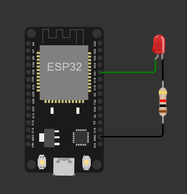

    ::: note
    - Comprueba de nuevo el `diagram.json`. ¿Qué ha pasado? ¿Puedes cambiar el color del LED a *verde* desde este archivo?
    - ¿Qué crees que puedes hacer con el *Library Manager*?
    :::

### 2.2. Encender y apagar un LED

Conecta un LED como se indica a continuación:


Ejecuta el siguiente programa:
```Arduino
#define LED_PIN 21
#define BUTTON_PIN 35

void setup() {
    pinMode(LED_PIN, OUTPUT);
    pinMode(BUTTON_PIN, INPUT_PULLUP);
}

void loop() {
    digitalWrite(LED_PIN, HIGH);
    delay(500);
    digitalWrite(LED_PIN, LOW);
    delay(500);
}
```

### 2.3. Controlar el estado del LED con un pulsador

- Implementa el circuito que se muestra en el siguiente diagrama y escribe un programa que:
    - Encienda el LED cuando se pulse el botón.
    - Apague el LED cuando no se pulse el botón.

    ::: tip
    - Usa la función [```digitalRead()```](https://docs.arduino.cc/language-reference/en/functions/digital-io/digitalread/) para leer el estado del botón.
    - Puede que necesites usar la condición [```if...else```](https://docs.arduino.cc/language-reference/en/structure/control-structure/else/).
    :::

    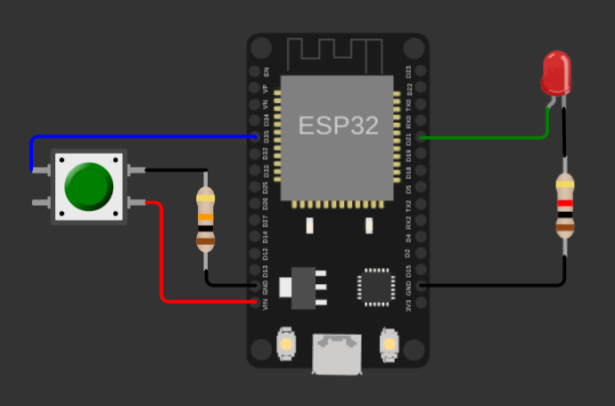

    ::: warning
    Cuando coloques el botón, no olvides desactivar la opción *bounce* para evitar [problemas de rebote](https://www.luisllamas.es/en/debouncing-arduino-interrupts/).

    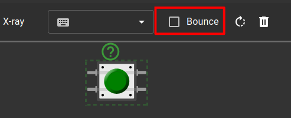
    :::

    ::: note
    - ¿Qué información se incluye en el archivo `diagram.json`? ¿Ha cambiado respecto al ejercicio anterior?
    - ¿Puedes completar el ejercicio sin usar la condición [```if...else```](https://docs.arduino.cc/language-reference/en/structure/control-structure/else/)? ¿Cómo?
    :::

### 2.4. Ejercicios adicionales

#### 2.4.1. Parpadeo

- Usando el mismo circuito que en el ejercicio anterior, escribe un programa que haga parpadear el LED mientras el botón está pulsado.

    ::: tip
    Puede que necesites usar la función [```millis()```](https://docs.arduino.cc/language-reference/en/functions/time/millis/).
    :::

#### 2.4.2. Pulsación corta frente a pulsación larga

- Usando el mismo circuito que en el ejercicio anterior, escribe un programa que haga lo siguiente:
    - Pulsación corta (< 500 ms): alterna el LED (si está encendido, lo apaga, y viceversa).
    - Pulsación larga (≥ 500 ms): hace parpadear el LED.

    ::: tip
    Puede que necesites usar la función [```millis()```](https://docs.arduino.cc/language-reference/en/functions/time/millis/) y la condición [```if...else```](https://docs.arduino.cc/language-reference/en/structure/control-structure/else/).
    :::
