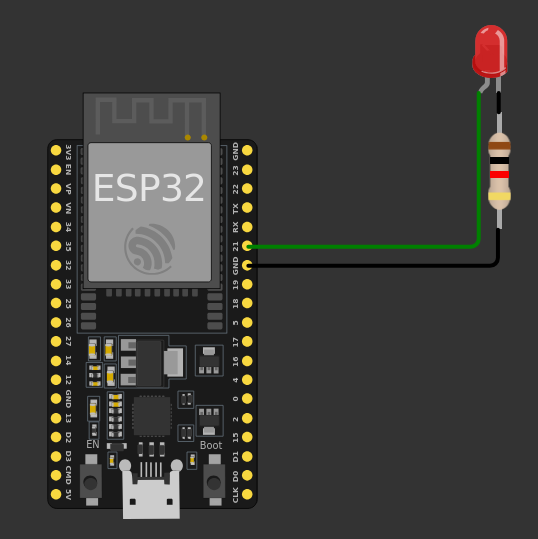

# Lab Session 1: Intro to microcontrollers programming

**Estimated time:** 1.5h (1 session)


## 1. Working with real hardware

### 1.1. Turn an LED ON and OFF
Connect an LED as follows:


Run the following program:
```Arduino
#include <M5Core2.h>
#define LED_PIN 14

void setup() {
  M5.begin(); // Initialize M5Core2
  pinMode(LED_PIN, OUTPUT);
}

void loop() {
  digitalWrite(LED_PIN, HIGH);
  delay(500);
  digitalWrite(LED_PIN, LOW);
  delay(500);
}
```

!!! question
    - What does the [```#define```](https://docs.arduino.cc/language-reference/en/structure/further-syntax/define/) do?
    - What does the [```pinMode()```](https://docs.arduino.cc/language-reference/en/functions/digital-io/pinMode/) function do?
    - What does the [```digitalWrite()```](https://docs.arduino.cc/language-reference/en/functions/digital-io/digitalwrite/) function do?

!!! question
    Note that you had to include the ```#include <M5Core2.h>``` and the ```M5.begin(); // Initialize M5Core```
    Why did you have to do that? what are these instructions for?

### 1.2. Additional exercises

#### 1.2.1. Blink at a certain frequency

- Using the same circuit as in the previous exercise, write a script that Blinks the LED at a frequency of 10Hz.

    !!! question
        - For how long does the LED has to be ON or OFF in each cycle?

#### 1.2.2. Blink and stop

- Using the same circuit as in the previous exercise, write a script that Blinks the LED at a frequency of 2Hz and stops the blinking after 5 seconds.

    !!! question
        - How many times does the LED blink?
        - What is the final state of the LED when the blink stops, does it remain ON or OFF?

    !!! tip
        You may need to use the [```for```](https://docs.arduino.cc/language-reference/en/structure/control-structure/for/) loop, or the  [```if...else```](https://docs.arduino.cc/language-reference/en/structure/control-structure/else/) condition.

## 2. Working in Simulation

### 2.1. Turn an LED ON and OFF
Connect an LED as follows:



Run the following program:
```Arduino
#define LED_PIN 21
#define BUTTON_PIN 35

void setup() {
    pinMode(LED_PIN, OUTPUT);
    pinMode(BUTTON_PIN, INPUT_PULLUP);
}

void loop() {
    digitalWrite(LED_PIN, HIGH);
    delay(500);
    digitalWrite(LED_PIN, LOW);
    delay(500);
}
```

### 2.2. Control the LED state with a push button

- Implement the circuit shown in the following diagram and simulate a program that:
    - Turns the LED ON when the button is pressed.
    - Turns the LED OFF when the button is not pressed.
  
    !!! tip
        - Use the function [```digitalRead()```](https://docs.arduino.cc/language-reference/en/functions/digital-io/digitalread/) to get the status of the button.
        - You may need to use the [```if...else```](https://docs.arduino.cc/language-reference/en/structure/control-structure/else/) condition.

    

    !!! warning
        When you place the button, don’t forget to deselect the *bounce* option to avoid [bouncing issues](https://www.luisllamas.es/en/debouncing-arduino-interrupts/).
        
        

    !!! question
        - What information is included in the ```diagram.json```? Did it change with respect to the previous exercise?  
        - Can you do the exercise without using the [```if...else```](https://docs.arduino.cc/language-reference/en/structure/control-structure/else/) condition? How?

### 2.3. Additional exercises

#### 2.3.1. Blink

- Using the same circuit as in the previous exercise, write a script that Blinks the LED while the button is pushed.

    !!! tip
        You may need to use the [```millis()```](https://docs.arduino.cc/language-reference/en/functions/time/millis/) function.

#### 2.3.2. Short press vs long press

- Using the same circuit as in the previous exercise, write a script that does the following:
    - Short press (< 500 ms): Toggle LED (if the LED is ON, turns it OFF, and viceversa).
    - Long press (≥ 500 ms): Blink LED.

    !!! tip
        You may need to use the [```millis()```](https://docs.arduino.cc/language-reference/en/functions/time/millis/) function, and the  [```if...else```](https://docs.arduino.cc/language-reference/en/structure/control-structure/else/) condition.