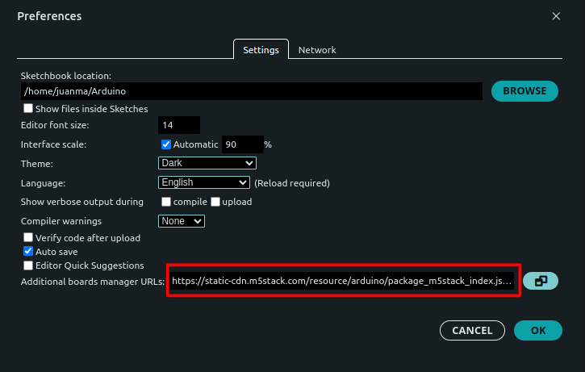
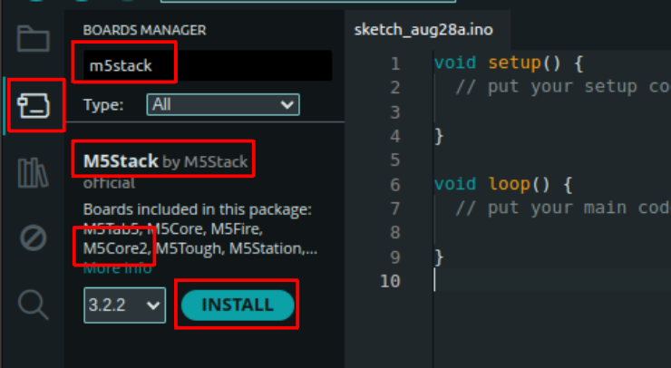
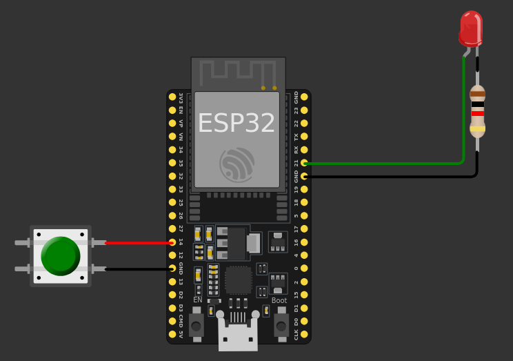
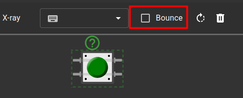

# Sesión de Laboratorio 1: Introducción a la programación de microcontroladores

**Tiempo estimado:** 1.5h (1 sesión)


## 1. Trabajando con hardware real


## 1.1. Preparar el IDE de Arduino
Sigue los pasos de instalación descritos en esta guía.

1. Instala el IDE de Arduino: Descárgalo desde [este enlace](https://www.arduino.cc/en/software/):
2. Instala la familia de placas M5Stack:

    

    Necesitas copiar/pegar este texto para descargar el paquete de placas:

    ```txt
    https://static-cdn.m5stack.com/resource/arduino/package_m5stack_index.json 
    ```

    

    Una vez configurada la dirección del paquete, puedes instalarlo desde el *gestor de placas*.
    
    


    **IMPORTANTE:** Recuerda instalar la versión 2.1.4. Si intentas instalar la versión 3.X, no podrás realizar los ejercicios de las sesiones de laboratorio. Más adelante hablaremos sobre las versiones 2.X y 3.X y cómo migrar nuestro código de una a otra. Por ahora, utiliza únicamente la versión 2.X.

    **IMPORTANTE:** Una vez que hayas hecho esto, si más adelante abres el Arduino IDE, aparecerá un mensaje informándote de que hay actualizaciones disponibles para algunas bibliotecas y preguntándote si deseas instalarlas o no.
        No actualices las bibliotecas.

    **INFO:** Este proceso puede tardar unos minutos.

    Una vez instalado, puedes seleccionar M5Core2 desde el menú de selección de placas.

    

3. Instala las librerías de Arduino para M5Core2:

    

    **NOTA:** Cuando pulses *Install*, verás la lista de dependencias. *DEBES* instalar también todas las dependencias.

    **INFO:** Este es un proceso largo que puede tardar varios minutos. Ten paciencia...

    **AYUDA:** Si la lista de dependencias es tan grande que no puedes ver el botón *Install All*, puedes pulsar la tecla *tabulador dos veces para poner el cursor sobre el botón y luego pulsar *Enter* para instalar todas las dependencias.

4. Instala el driver CP2104 (controlador USB):

    - [Enlace para Windows](https://m5stack.oss-cn-shenzhen.aliyuncs.com/resource/drivers/CP210x_VCP_Windows.zip)
    - [Enlace para MacOS](https://m5stack.oss-cn-shenzhen.aliyuncs.com/resource/drivers/CP210x_VCP_MacOS.zip)
    - [Enlace para Linux](https://m5stack.oss-cn-shenzhen.aliyuncs.com/resource/drivers/CP210x_VCP_Linux.zip)

    Más información sobre la instalación del controlador USB [aquí](https://docs.m5stack.com/en/arduino/m5core2/program#2.usb%20driver%20installation).

    Ahora, cuando conectes el dispositivo M5Core2 al PC con el cable USB, podrás seleccionar el puerto en el IDE de Arduino.
    

    **INFO:**
     - En Windows, el puerto se llama *COMX*, donde *X* es un número que puede variar, por ejemplo, *COM5*.
     - En Linux, el puerto se llama "ttyUSBX" o "ttyACMX", donde *X* es un número que puede variar, por ejemplo, *ttyUSB2*.

5. Compila y sube el ejemplo ```hello_world.ino``` de la librería *M5Core2*:

    

    Puedes pulsar el botón *Upload* (en rojo) para compilar y cargar el programa en el dispositivo. Observa que el botón de la izquierda (*Verify* - en verde) compila el programa pero no lo sube al dispositivo.

    

6. *OPCIONAL (hazlo* **SOLO si has terminado todos los ejercicios** *de la sesión):* Puedes abrir otros ejemplos si quieres ver el potencial del M5Core2. Por ejemplo:

    


**AYUDA:** "Recursos adicionales"
    [Aquí](https://docs.m5stack.com/en/core/core2) puedes encontrar más documentación sobre algunas funciones básicas del M5Core2.

**Pinout y notas importantes**
A continuación se muestra el pinout del M5Core2. Los pines marcados en rojo son los que usaremos en los ejercicios.


**NOTA:**
 - Algunos *pines* del M5Core2 están preconfigurados, así que presta atención al conectar componentes externos.
 - El ESP32 dentro del M5Core2 tiene 3 puertos serie:
   - ```Serial1``` está reservado para la pantalla (no lo uses).
   - ```Serial0``` se puede configurar (pines ```G3 – RXD0``` y ```G1 – TXD0```), pero está reservado para la conexión USB al PC.
   - ```Serial2``` está libre y se puede configurar (pines G13 – RXD2 y G14 – TXD2) como GPIO normales usando ```pinMode()```.


### 1.2. Encender y apagar un LED
Conecta un LED como se muestra:


Ejecuta el siguiente programa:
```Arduino
#include <M5Core2.h>
#define LED_PIN 14

void setup() {
  M5.begin(); // Initialize M5Core2
  pinMode(LED_PIN, OUTPUT);
}

void loop() {
  digitalWrite(LED_PIN, HIGH);
  delay(500);
  digitalWrite(LED_PIN, LOW);
  delay(500);
}
```

**PREGUNTA:**

- ¿Qué hace [```#define```](https://docs.arduino.cc/language-reference/en/structure/further-syntax/define/)?
- ¿Qué hace la función [```pinMode()```](https://docs.arduino.cc/language-reference/en/functions/digital-io/pinMode/)?
- ¿Qué hace la función [```digitalWrite()```](https://docs.arduino.cc/language-reference/en/functions/digital-io/digitalwrite/)?

**PREGUNTA:**

- Te habrás dado cuenta de que has tenido que incluir ```#include <M5Core2.h>``` y ```M5.begin(); // Initialize M5Core``` ¿Por qué tuviste que hacerlo? ¿Para qué sirven estas instrucciones?

### 1.3. Ejercicios adicionales

#### 1.3.1. Parpadear a una cierta frecuencia

- Usando el mismo circuito del ejercicio anterior, escribe un script que haga parpadear el LED a una frecuencia de 10 Hz.

**PREGUNTA:**

- ¿Durante cuánto tiempo debe estar ENCENDIDO o APAGADO el LED en cada ciclo?

#### 1.3.2. Parpadear y detener

- Usando el mismo circuito del ejercicio anterior, escribe un script que haga parpadear el LED a una frecuencia de 2 Hz y detenga el parpadeo después de 5 segundos.

**PREGUNTA:**

- ¿Cuántas veces parpadea el LED?
- ¿Cuál es el estado final del LED cuando se detiene el parpadeo, permanece ENCENDIDO o APAGADO?

**PISTA:**

- Puede que necesites usar el bucle [```for```](https://docs.arduino.cc/language-reference/en/structure/control-structure/for/), o la condición [```if...else```](https://docs.arduino.cc/language-reference/en/structure/control-structure/else/).

## 2. Trabajando en simulación

### 2.1. Simulación de microcontroladores

#### Ejecutar un ejemplo

- Accede al entorno de simulación Wokwi a través de [este enlace](https://wokwi.com/).
- Selecciona la plantilla ESP32.
  
    
    

    **NOTA:** Abre la plantilla ESP32 desde ```Starter Templates```, no desde ```ESP-IDF Templates```. La primera está basada en el IDE de Arduino, mientras que la segunda está basada en el entorno ESP-IDF que **no** se usará en el curso.

- Simula el sketch de ejemplo:
  
    ```Arduino
    void setup() {
    // código de configuración, se ejecuta una sola vez:
    Serial.begin(115200);
    Serial.println("Hello, ESP32!");
    }

    void loop() {
    // código principal, se ejecuta repetidamente:
    delay(10); // esto acelera la simulación
    }
    ```

    **NOTA:** Aquí estás *simulando* el comportamiento del sistema, incluido el código; no estás *compilando* el código (es decir, no se está generando el código máquina que ejecutará un procesador). Pero el código DEBE ser compilable (es decir, se verificará que podría compilar).

    **INFO:**
    - Observa que el factor de tiempo real en la esquina superior derecha debe estar lo más cerca posible del 100%. Este valor es una métrica de rendimiento de la simulación. Cuanto más cerca esté de 100%, mejor será la simulación. Un valor del 100% significa que la simulación se ejecuta en tiempo real. Si el valor baja, los tiempos de la simulación dejan de ser fiables.
    - Observa la instrucción ```delay(10); // esto acelera la simulación```. Prueba a comentar esta línea y observa qué ocurre. ¿Qué pasa si pones ```delay(1);``` o ```delay(5);```?

    **PREGUNTA:**
    - ¿Cuál es el propósito de la función setup()?
    - ¿Cuál es el propósito de la función loop()?
    - ¿Qué hace la función delay()?
    - ¿Por qué necesitamos poner delay(10) dentro de la función loop()?

#### Añadir componentes de hardware
- Primero, revisa el archivo ```diagram.json```. ¿Qué información tiene?

- Conecta un LED al ```GPIO 21``` con una resistencia, como se muestra en el diagrama (rota - *tecla R* y voltea - *tecla P* los componentes si es necesario).

    


    **PREGUNTA:**
    - Revisa de nuevo el ```diagram.json```. ¿Qué ha cambiado? ¿Puedes cambiar el color del LED a *verde* desde este archivo?
    - ¿Qué crees que puedes hacer con el *Library Manager*?


### 2.2. Encender y apagar un LED
Conecta un LED como se muestra:


Ejecuta el siguiente programa:
```Arduino
#define LED_PIN 21
#define BUTTON_PIN 35

void setup() {
    pinMode(LED_PIN, OUTPUT);
    pinMode(BUTTON_PIN, INPUT_PULLUP);
}

void loop() {
    digitalWrite(LED_PIN, HIGH);
    delay(500);
    digitalWrite(LED_PIN, LOW);
    delay(500);
}
```

### 2.3. Controlar el estado del LED con un pulsador

- Implementa el circuito mostrado en el siguiente diagrama y simula un programa que:
    - Encienda el LED cuando se pulse el botón.
    - Apague el LED cuando el botón no esté pulsado.
  
**PISTA:**

- Usa la función [```digitalRead()```](https://docs.arduino.cc/language-reference/en/functions/digital-io/digitalread/) para obtener el estado del botón.
- Puede que necesites usar la condición [```if...else```](https://docs.arduino.cc/language-reference/en/structure/control-structure/else/).



**INFO:**

- Al colocar el botón, no olvides deseleccionar la opción *bounce* para evitar problemas de [rebotes](https://www.luisllamas.es/en/debouncing-arduino-interrupts/).



**PREGUNTA:**

- ¿Qué información se incluye en el ```diagram.json```? ¿Cambió con respecto al ejercicio anterior?  
- ¿Se puede hacer el ejercicio sin usar la condición [```if...else```](https://docs.arduino.cc/language-reference/en/structure/control-structure/else/)? ¿Cómo?

### 2.4. Ejercicios adicionales

#### 2.4.1. Parpadear

- Usando el mismo circuito del ejercicio anterior, escribe un script que haga parpadear el LED mientras se mantiene pulsado el botón.

**PISTA:**

- Puede que necesites usar la función [```millis()```](https://docs.arduino.cc/language-reference/en/functions/time/millis/).

#### 2.4.2. Pulsación corta vs pulsación larga

- Usando el mismo circuito del ejercicio anterior, escribe un script que haga lo siguiente:
    - Pulsación corta (< 500 ms): Alternar el LED (si el LED está ENCENDIDO, apagarlo, y viceversa).
    - Pulsación larga (≥ 500 ms): Hacer parpadear el LED.

**PISTA:**

- Puede que necesites usar la función [```millis()```](https://docs.arduino.cc/language-reference/en/functions/time/millis/) y la condición [```if...else```](https://docs.arduino.cc/language-reference/en/structure/control-structure/else/).
