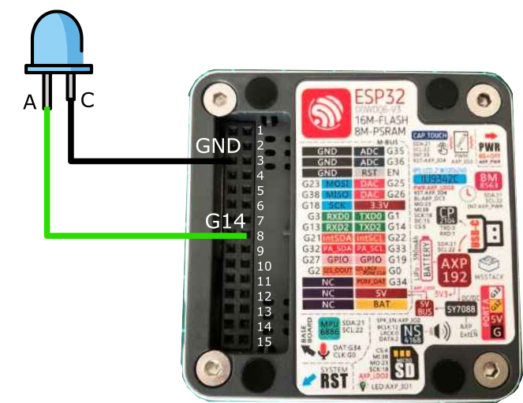

# Lab Session 2: Timers

**Estimated time:** 1.5h (1 session)

## 1. Description

The goal of this session is to learn the different ways a microcontroller can perform timing operations. As seen previously, the ```delay()``` function can be used to create a wait for the required amount of time. However, to solve slightly more complex problems, it becomes necessary to use *timers*, which allow us to interrupt the normal execution of the program in order to handle a periodic event.

## 2. Use of an external library - _Ticker_

The [Arduino Ticker Library](https://github.com/sstaub/Ticker?tab=readme-ov-file) allows you to create easily Ticker callbacks, which can call a function in a predetermined interval
The following example shows how to perform timing operations using the _Ticker_ library and the ```attach()``` or ```attach_ms()``` functions.

```Arduino
#include <M5Core2.h>   // M5Stack Core2 library
#include <Ticker.h>    // Ticker library

#define LED_PIN 14     // GPIO pin where the LED is connected on the M5Core2

Ticker blinker;        // Create a Ticker object. It will call a function at regular intervals.

/*
  This function (callback) will be called by the Ticker at the configured time interval.
  It simply toggles the LED state:
    - digitalRead(LED_PIN) reads the current state (HIGH/LOW)
    - ! inverts that state
    - digitalWrite writes the inverted state back to the pin
*/
void changeState()
{
    digitalWrite(LED_PIN, !(digitalRead(LED_PIN))); 
}

void setup() 
{
    M5.begin();          // Initialize the M5Core2 hardware (display, I2C, etc.)
    pinMode(LED_PIN, OUTPUT); // Configure the LED pin as an output

    // Initialize the Ticker to call changeState() periodically.
    // attach() accepts time in seconds (here 0.5 s = 500 ms).
    // If you prefer milliseconds, use attach_ms(milliseconds, callback).
    blinker.attach(0.5, changeState); 
}

void loop() 
{      
    // Empty: the Ticker handles the periodic LED toggling asynchronously.
}
```

Connect an LED to _pin 14_ of the _M5Core2_ and modify this example so that the LED blinks every second instead of every 500 ms.



## 3. Use hardware timers

However, as stated in the library documentation, "The library use no interupts of the hardware timers and works with the micros() / millis() function."