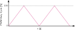
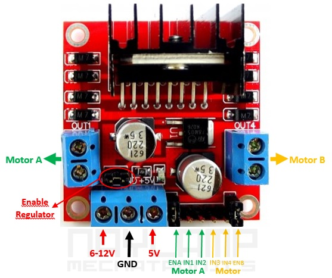

Informática Industrial  
Grado en Ingeniería Electrónica Industrial  
Universidad de Málaga  
[Juan M. Gandarias](https://jmgandarias.com)  
[Carlos J. Pérez del Pulgar](https://www.uma.es/isa/info/76432/cperez/)

# Sesión de Laboratorio 3: PWM

**Tiempo estimado:** 1,5 h (una sesión)

## Descripción

El objetivo de esta práctica es comprender la generación y el uso de señales PWM, así como el control de un motor mediante este tipo de señales. Para ello, se dispone de un motor de corriente continua (CC; DC, por sus siglas en inglés), una controladora de motores basada en el puente H L298N y un M5Core2.

## 1. Trabajo con hardware real

### Parte 1: Generación de PWM con un LED

Generar una señal PWM que permita variar el brillo de un LED conectado al GPIO14 del M5Core2. Puedes encontrar información sobre la programación en la [hoja de referencia](https://eii.cv.uma.es/pluginfile.php/41800/mod_resource/content/3/hoja_referencia.pdf) de la asignatura.

El LED debe encenderse de forma progresiva, desde el estado completamente apagado (ciclo de trabajo PWM del 0 %) hasta el estado completamente encendido (ciclo de trabajo PWM del 100 %). Una vez alcanzado el 100 %, debe apagarse también de forma progresiva, desde un ciclo de trabajo PWM del 100 % hasta el 0 %. En ambos casos, se seguirá un perfil de tipo "rampa", primero creciente y después decreciente, como el que se muestra en la siguiente figura:

### Parte 2: Generación de PWM con un motor CC

La siguiente figura muestra la ubicación de los conectores de la controladora:

Esta controladora permite controlar hasta dos motores CC de forma simultánea. En la figura anterior, los puertos verdes corresponden al motor A y los amarillos, al motor B.

Conectar el M5Core2 a la controladora de motores (puente H L298N) como se indica a continuación:

- Conectar GPIO14 al pin IN1 de la controladora. Esta salida PWM permitirá establecer la potencia en el sentido de giro positivo (sentido contrario a las agujas del reloj).
- Conectar GPIO13 al pin IN2 de la controladora. Esta salida PWM permitirá establecer la potencia en el sentido de giro negativo (sentido de las agujas del reloj).
- Conectar el terminal VS de la controladora al polo positivo de una fuente de alimentación de 9-12 V y el terminal GND al polo negativo.
- Conectar GND (M5Core2) a GND (controladora). Es imprescindible conectar las masas de la controladora y del microcontrolador; de lo contrario, no se conocería la referencia de las señales PWM.
- Conectar el motor a la controladora en los terminales del motor A.
- Es imprescindible que el pin ENA de la controladora esté alimentado; de lo contrario, la salida del motor A estaría deshabilitada. Para ello, se dispone de un [jumper](https://es.wikipedia.org/wiki/Jumper_(inform%C3%A1tica)) que permite alimentar el pin ENA con el regulador de 5 V que incluye la propia controladora.

Puedes encontrar un tutorial sencillo sobre el uso de esta controladora en [este enlace](https://naylampmechatronics.com/blog/11_tutorial-de-uso-del-modulo-l298n.html).

Una vez conectado el microcontrolador al motor, modificar el código del tutorial para que el motor gire acelerando en el sentido de giro positivo, desde un ciclo de trabajo PWM del 0 % hasta el 100 %, y después decelerando desde el 100 % hasta el 0 %. Cuando se hayan completado la aceleración y la deceleración en el sentido de giro positivo, hacer lo mismo en el sentido negativo y repetir esta secuencia indefinidamente, como se indica en la siguiente imagen:

::: note
- ¿Qué ocurre cuando se cambia la frecuencia del PWM? Probar con frecuencias entre 1 y 10 kHz.
- ¿Qué ocurre cuando se cambia la resolución del PWM? Probar con resoluciones entre 8 y 10 bits.
- Si se cambia la resolución, ¿hay que cambiar algo más del código o basta con cambiar el valor de la resolución?
:::

## 2. Trabajo en simulación

### Parte 1: Generación de PWM con un LED

El ejercicio se puede realizar exactamente igual en simulación que con hardware real.

### Parte 2: Generación de PWM con un motor CC

Este ejercicio no se puede realizar exactamente igual en simulación que con hardware real porque en Wokwi no existe ningún componente de motor de corriente continua. Sin embargo, existen varias formas de trabajar en simulación para prototipar el código del motor.

Una forma sencilla sería utilizar dos LED: el LED 1 simularía el comportamiento del motor cuando gira en sentido horario, mientras que el LED 2 simularía el comportamiento del motor cuando gira en sentido antihorario. De esta forma, se pueden programar las señales PWM de ambos LED de forma similar a las señales PWM que se enviarían a IN1 e IN2 de la controladora para controlar el sentido de giro del motor.

::: tip
- Para comprobar el correcto funcionamiento del código, es muy importante verificar que los dos LED no estén encendidos a la vez.
:::

::: tip
- Al trabajar con PWM en Wokwi, el rendimiento en tiempo real puede disminuir considerablemente, especialmente si se generan varias señales PWM y se cambia el ciclo de trabajo en cada paso del bucle. Para evitarlo, es aconsejable cambiar el ciclo de trabajo de forma escalonada cada varios pasos del bucle o introducir un tiempo de espera lo suficientemente largo.
:::
