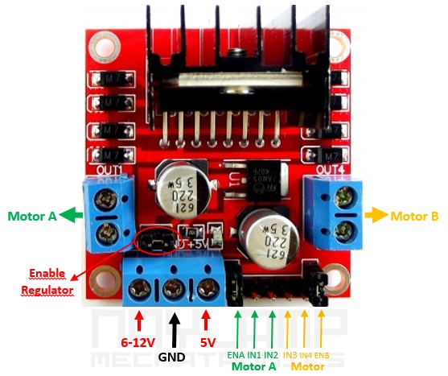

# Lab Session 3: PWM

**Estimated time:** 1.5 h (1 session)

## Description

The goal of this lab session is to understand the generation and use of PWM signals, as well as controlling a DC motor using these signals. For this lab you have a DC motor, a motor driver based on the L298N H-bridge, and an M5Core2.

## 1. Working with real hardware

### Part 1 - Generating PWM with an LED

Perform a test that generates a PWM signal to vary the brightness of an LED connected to pin 14 of the M5Core2. [This tutorial](https://www.luisllamas.es/esp32-pwm/) explains how to do it.

The LED must smoothly increase brightness from completely off (0% PWM) to fully on (100% PWM). Once at 100%, it must smoothly dim back down to 0% PWM. Both the rising and falling phases should follow a "ramp" profile, like the figure below:

### Part 2 - Generating PWM for a DC motor

The image below shows the connector layout of the motor driver:

This driver can control up to two DC motors simultaneously. In the previous image, the green ports correspond to motor A and the yellow ports to motor B.

Wire the M5Core2 to the L298N motor driver as follows:

- `GPIO14` to `IN1` on the driver. This PWM output will set the power for the positive rotation direction (counterclockwise).
- `GPIO13` to `IN2` on the driver. This PWM output will set the power for the negative rotation direction (clockwise).
- Connect `GND` and `VS` (on the driver) to a 9–12 V power supply.
- Connect `GND` (M5Core2) to `GND` (driver). It is essential to share grounds; otherwise the PWM signal reference is undefined.
- Connect the motor to the motor A terminals on the driver.
- Ensure the `ENA` pin on the driver is powered/enabled; otherwise motor A output will be disabled. The driver includes a [jumper](https://es.wikipedia.org/wiki/Jumper_(inform%C3%A1tica)) that can power `ENA` from its onboard 5 V regulator.

A simple tutorial on using this driver can be found [here](https://naylampmechatronics.com/blog/11_tutorial-de-uso-del-modulo-l298n.html).

After wiring the microcontroller to the motor, modify the tutorial code so that the motor accelerates in the positive direction from 0% PWM to 100% PWM, then decelerates from 100% back to 0% PWM. After completing accelerate/decelerate in the positive direction, repeat the same sequence in the negative direction, then loop this sequence indefinitely. The profile should be similar to the following image:

!!! question
    - What happens when the PWM frequency is changed? Test frequencies between 1 kHz and 10 kHz.
    - What happens when the PWM resolution is changed? Test resolutions between 8 and 10 bits.
    - If the resolution is changed, is any other code change required or is it sufficient to update the resolution value passed to ledcSetup?

## 2. Working in simulation

### Part 1 - Generating PWM with an LED

This exercise can be performed the same way in simulation as on real hardware.

### Part 2 - Generating PWM for a DC motor

This exercise cannot be performed exactly the same in simulation because Wokwi does not include a DC motor component. However, there are ways to prototype motor code in simulation.

A simple approach is to use two LEDs: LED1 simulates the motor behavior when rotating clockwise, and LED2 simulates rotation counterclockwise. Program the PWM signals for both LEDs in the same way you would for IN1 and IN2 on the driver. This lets you validate the PWM logic that will be used for the real motor.

!!! info
    - To verify correct operation, ensure both simulated motor LEDs are never on at the same time.

!!! tip
    - When using PWM in Wokwi, real-time performance may degrade significantly if many PWM updates occur each loop iteration. To avoid this, change duty cycle in steps every several loop iterations or add a sufficiently large delay between updates. I.e., use a steps-like signal instead of a ramp-like signal.
