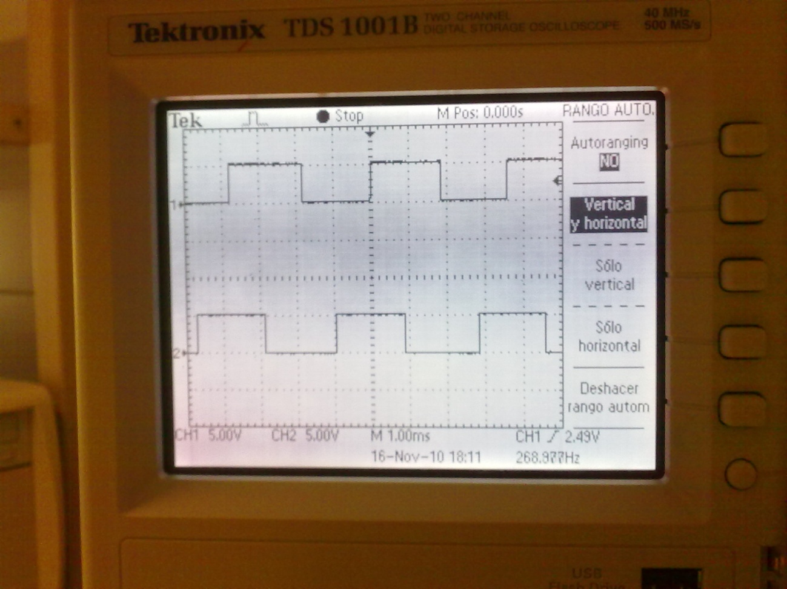
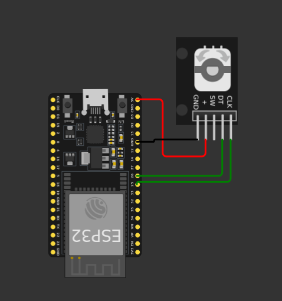

# Lab Session 4: Encoder

**Estimated time:** 1.5 h (1 session)

## Description

Incremental encoders are commonly used to determine the angular position of a motor shaft. The objective of this lab is to program an ESP32 to read the sensor so that we can determine the shaft's position at any instant, subject to the encoder's resolution.

An incremental encoder usually provides four signals:

- GND: Ground.
- Vcc: Supply voltage (3–5 V).
- Channel A: Encoder channel A.
- Channel B: Encoder channel B.

!!! warning
    GND must be used as the reference for signals A and B.

If you connect both channels to an oscilloscope and rotate the motor shaft, you will observe signals similar to those shown in the image below:



!!! warning 
    If the shaft does not move, the signals will not change.

## Working with the real hardware

### Part 1 - Identifying the signals

Power the encoder by making the following connections:

| Motor cables       | M5 Core2 |
|--------------------|----------|
| Motor+ (red)       | -        |
| Encoder- (black)   | GND      |
| Channel A (yellow) | -        |
| Channel B (green)  | -        |
| Encoder+ (blue)    | 3.3V     |
| Motor+ (white)     | -        |


!!! warning
    Do not power the encoder with 5 V!

!!! warning
    Double-check the connections. Incorrect wiring may damage the encoder's electronics.

Connect the oscilloscope to encoder signals A and B, and connect GND to the oscilloscope's ground. Verify that the waveforms match the image above. It is recommended to use the oscilloscope's Run/Stop button to freeze the waveform while the motor is turning so that you can inspect it.

!!! note
    Note that swapping the A and B signals on the oscilloscope reverses the apparent direction of rotation. For example, if you connect A to oscilloscope channel 1 and B to channel 2, signal A will change before signal B when you rotate the wheel clockwise, and signal B will change first when you rotate it counterclockwise. If you connect A to channel 2 and B to channel 1, signal B will appear before signal A during clockwise rotation, and signal A will appear first during counterclockwise rotation.

Once you have identified the clockwise and counterclockwise rotations from signals A and B, connect the encoder ground (GND) to the microcontroller and connect channels A and B to the digital inputs GPIO 27 and GPIO 19.

| Motor cables       | M5 Core2 |
|--------------------|----------|
| Motor+ (red)       | -        |
| Encoder- (black)   | GND      |
| Channel A (yellow) | GPIO27   |
| Channel B (green)  | GPIO26   |
| Encoder+ (blue)    | 3.3V     |
| Motor+ (white)     | -        |

!!! note
    The rotation direction will be important in the next lab session, so record it.


### Part 2 - Counting encoder pulses

Develop an Arduino program to count the pulses generated by both signals. Store the count in a global variable and account for changes in direction by incrementing or decrementing the counter. Use interrupts on the digital inputs.

To count the pulses, consider the rising and/or falling edges of each channel and read the state of the other channel after each edge. For example, if a rising edge occurs on A and both A and B are high after the edge, the shaft is rotating in one direction (positive: increment the counter). If A is high and B is low after a rising edge on A, the shaft is rotating in the opposite direction (negative: decrement the counter). The figure below shows an example in which B leads A, corresponding to rotation in one direction. If the direction of rotation is reversed, A leads B. You can verify this with the oscilloscope or by turning the motor by hand.


An example of an interrupt handler implementation is shown below:

```cpp
void IRAM_ATTR ISR_Example()
{
  ...
}
```

You can send the counter value through the Serial port as follows:

```cpp
void setup()
{
  ...
  Serial.begin(9600);
}

void loop()
{
  ...
  Serial.println(counter);
}
```

### Part 3 - Pulses per revolution

Determine the number of pulses per revolution that can be read at the output shaft of the motor. Each pulse produces one rising edge and one falling edge.

!!! note
    Note that the encoder produces only 11 pulses per revolution at the encoder shaft. You must also account for the rising and falling edges of both channels.

!!! question
    - If only the rising edges of channel A are considered, how many pulses per revolution can be measured?
    - What if the rising edges of channels A and B are considered?
    - What if both the rising and falling edges of channels A and B are considered?

!!! question
    Could you send the position in degrees instead of encoder pulses through the Serial port? How?

## Working in simulation

You can simulate an encoder in Wokwi using the Rotary Encoder component: https://docs.wokwi.com/parts/wokwi-ky-040/. The simulation diagram should look like this:



!!! question
    What differences are there between the operation of this encoder and that of the encoder used with the motor in the lab?
