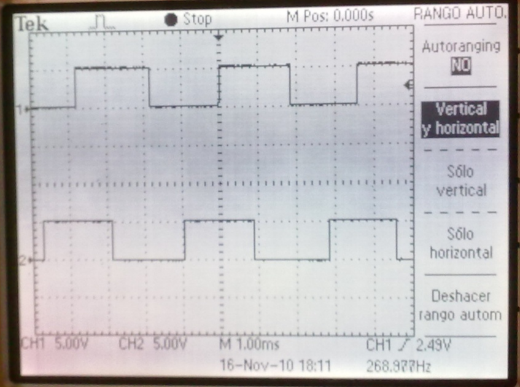

# Lab Session 4: Encoder

**Estimated time:** 1.5 h (1 session)

## Description

To know the angular position of a motor shaft, incremental encoders are commonly used. The objective of this lab is to program the reading of this kind of sensor so we can know the exact position (subject to the encoder resolution) of the motor shaft at any instant.

An incremental encoder usually provides 4 signals:

- GND: Ground.
- Vcc: Supply (3–5 V).
- Channel A: Encoder channel A.
- Channel B: Encoder channel B.

!!! warning
    In the lab, the encoder is powered directly from an internal 5 V regulator provided by the equipment electronics. That means it is not necessary to power the encoder externally. However, GND must be considered as the reference for the A and B signals.

If you connect both channels to an oscilloscope and rotate the motor shaft, you will see signals like those in the image:



!!! warning 
    If the shaft is not moved, the signals will not change.

## Working with real hardware

### Part 1 - Signal identification

Connect the oscilloscope to the encoder and identify the colour of each signal on the motor to be used. Record this colour-to-signal mapping for later use with the microcontroller. Connect channels A and B and ground to the oscilloscope and verify that the responses match the image above. It is recommended to use the oscilloscope Run/Stop button to freeze the waveform while the motor is turning so you can inspect it.

Connect the encoder ground (GND) to the microcontroller, and channels A and B to the digital inputs GPIO 27 and GPIO 19. This connection cannot be made directly as described below.

!!! warning
    The encoder is powered at 5 V. That means the A and B signals, when high and unloaded, present 5 V. The ESP32 electronics works at 3.3 V, so you must not connect A and B directly to the microcontroller inputs. Use a voltage divider. Consider the encoder internal electronics (see image below).


The A and B channels already include a 3.3 kΩ pull-up resistor. Therefore, to build the divider you only need to add the lower resistor of the divider.


!!! question
    What is the theoretical value of the resistor R to place as the lower resistor of the divider so that the channels A and B go from 5 V to 3.3 V when high?

Assemble the circuit with the divider and verify with the oscilloscope that the high-level voltage on channels A and B does not exceed 3.3 V.

### Part 2 - Counting encoder pulses

Develop Arduino code to count pulses generated by both signals. Store the count in a global variable and account for direction changes to increment or decrement the counter. Use interrupts on the digital inputs.

To count pulses you must consider rising and/or falling edges of each channel and read the state of the other channel after the edge. For example: if there is a rising edge on A, and both A and B are high after the edge, rotation is in one direction (positive — increment the counter). If after a rising edge on A, A is high and B is low, rotation is in the opposite direction (negative — decrement the counter). The figure below shows an example where B leads A (rotation in one direction). If rotation reversed, A would lead B. You can verify this on the oscilloscope or by turning the motor by hand.


Example of an interrupt handler implementation:

```cpp
ICACHE_RAM_ATTR void ISR_Example()
{
  ...
}
```

You can send the counter value over the Serial port as follows:

```cpp
void setup()
{
  ...
  Serial.begin(9600);
}

void loop()
{
  ...
  Serial.println(counter);
}
```

### Part 3 - Pulses per revolution

Check the pulses per revolution produced by the encoder. Find this information in the motor/encoder technical details and verify experimentally with the real encoder.

!!! question
    - If only the rising edges of channel A are considered, how many pulses per revolution could we measure?
    - What if rising edges of channels A and B are considered?
    - What if rising and falling edges of channels A and B are considered?

!!! question
    Could we send the position in degrees instead of encoder pulses over the serial port? How?

## Working in simulation

You can simulate an encoder in Wokwi using the Rotatory Encoder component: https://docs.wokwi.com/parts/wokwi-ky-040/. The simulation diagram would look like this:


!!! question
    What differences exist between the operation of this encoder and the encoder used with the motor in the lab?
