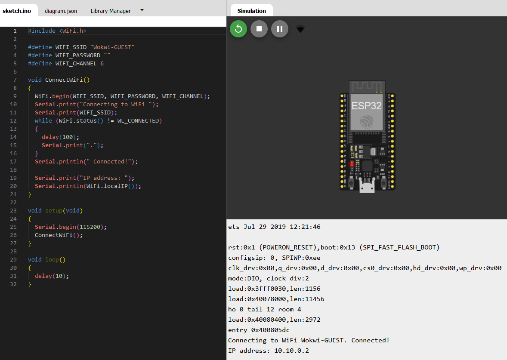

---
title: "1. Connect to a network via WiFi "
--- 

In order to develop an IoT application using MQTT with an ESP32, the first thing we need to do is to connect the device to a network. Although this can be done in several ways, the most convenient way is to do it to a WiFi network. 

Let's do it in [Wokwi](https://wokwi.com/)!

!!! warning
    As we are working in wokwi remotely, the ESP32 will have to connect to a wifi network accessible from the wokwi servers (i.e., you cannot connect the device to your WiFi network). Wokwi simulates a WiFi network with full internet access and provides a virtual WiFi access point called Wokwi-GUEST. It is an open access point - no password is required. For more info about network access in wokwi, check [this link](https://docs.wokwi.com/guides/esp32-wifi).

1. Open a new project in wokwi and load the following diagram.json.

    <details>
        <summary>Show diagram.json</summary>
        ```json title="diagram.json"
        --8<-- "snippets/mqtt/wifi_connect/diagram.json"
        ```
    </details>

2. Run the following code


    ```arduino title="wifi_connect.ino"
    --8<-- "snippets/mqtt/wifi_connect/wifi_connect.ino"
    ```

    1. The [ESP32 WiFi library](https://github.com/espressif/arduino-esp32/blob/master/libraries/WiFi/src/WiFi.h) is based on the [Arduino WiFi library](https://docs.arduino.cc/libraries/wifi/) and enables network connection (local and Internet) via WiFi.
    2. Here we define the name of the wifi network to which we want the device to connect. If you want to use the ESP32 in the real world, you need to enter the name of your local network
    3. Introduce the password of the network
    4. This is required in wokwi only. According to the [documentation](https://docs.wokwi.com/guides/esp32-wifi): We specify the WiFi channel number (6) when calling WiFi.begin(). This skips the WiFi scanning phase and saves about 4 seconds when connecting to the WiFi.
    5. This function is used to connect to the WiFi network (you can reuse it in your projects).
    6. This method initializes the WiFi library's network settings. If you don't want to use WIFI_CHANNEL (i,e., in real world project), you can delete the third argument of the function.    
    7. Wait until the device has connected to the network, when it's connected, it will display it through the serial port.
    8. The function `ConnectWiFi()` is called from the `setup()` so that the device connects to the network at the beginning of the program.
    9. This scripts doesn't do anything else, so there's nothing inside the `loop()`. Don't forget the `delay(10)` to speed up the simulation in wokwi (this is not needed in real world applications)

3. If you have done it correctly, you should see the following

    

!!! success "CONGRATULATIONS!"
    Now you're able to connect an ESP32 to a WiFi network