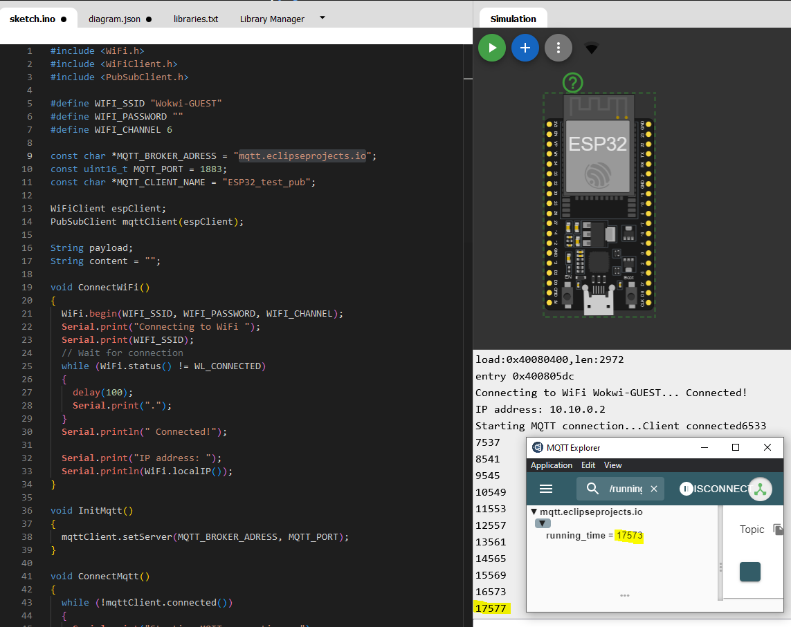
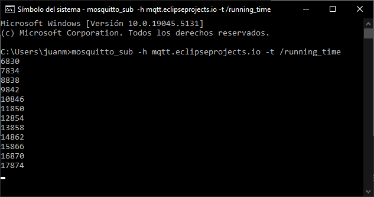

---
title: "3. Create a publisher"
--- 

Let's give some action to our MQTT application. This entry shows how you can create a _publisher_ with an ESP32 in wokwi that can send messages to your PC. 

!!! Warning "Client and Topic names" 
    You're going to use a public broker that is used by many people simultaneously. Hence, you must choose the clients and topics name with this in mind. I.e., avoid using generic names as a `test` or `example`. Also, emember that the client name is unique.

1. Open a new project in wokwi and load the following diagram.json.

    <details>
        <summary>Show diagram.json</summary>
        ```json title="diagram.json"
        --8<-- "snippets/mqtt/client_publisher/diagram.json"
        ```
    </details>

2. Run the following code


    ```arduino title="client_publisher.ino"
    --8<-- "snippets/mqtt/client_publisher/client_publisher.ino"
    ```

    1. The client will publish messages to a topic using the method  [`publish()`](https://github.com/knolleary/pubsubclient/blob/master/src/PubSubClient.cpp) from the `PubSubClient.h` library. Checking the code of that method you will see it publishes `char` data. Remember the **difference between `char` and `String`**: In C++, the sequence of characters can be stored in two ways: either as a `std::string` (`String` in _Arduino_) object or `char array`. The latter is an array that contains single characters terminated by a null character, while the former creates an object that is used to represent strings in C++ and contain many methods to help in string manipulation. Since it's easier to manipulate `String`data than `char` data, we will use the `String` object `payload` to store the message that will be publish. This message, however, will need to be casted to a `char`before being published with [`publish()`](https://github.com/knolleary/pubsubclient/blob/master/src/PubSubClient.cpp) (explained later in the code). 
    2. This function is used to publish `data` in a specific topic. It receives the `data` as a parameter (in this case `data` is an `unsigned long` variable, but it could have been something else, e.g., a `boolean`, or a `float`). The content of data need to be casted into `String`: here's when you use the `payload` variable. Then, the content of `payload` need to be casted into `char` according to the specifications of the method [`publish()`](https://github.com/knolleary/pubsubclient/blob/master/src/PubSubClient.cpp). This is done with `(char *)payload.c_str()`.
    3. The function `PublishMqtt()` is called in the loop every 1s. The running time in milliseconds is given as a parameter to that function, meaning that will be the message to be published. 


3. If you have done it correctly, you should see the following

    

    !!! info
        By checking the topic in _MQTT Explorer_ you can see the time in milliseconds it takes for the ESP32 to publish the message and print over the serial port: _4 ms_ (it has to run the code inside `PublishMqtt()`, which also runs the method [`publish()`](https://github.com/knolleary/pubsubclient/blob/master/src/PubSubClient.cpp)).

4. Subscribe to the topic in your terminal 

    Run the following command in the terminal and you'll see that the ESP32 is communicating with your PC via MQTT as shwon in the image below
    ```
    mosquitto_sub -h mqtt.eclipseprojects.io -t /running_time
    ```

    

!!! success "CONGRATULATIONS!"
    Now you're able to publish messages to a MQTT topic with an ESP32.