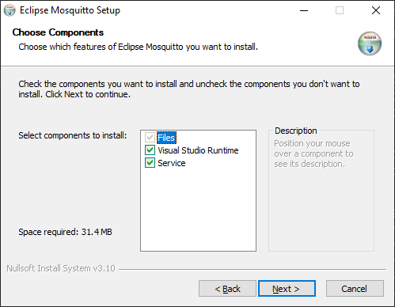
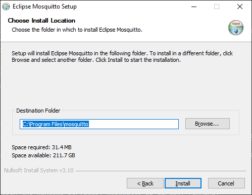
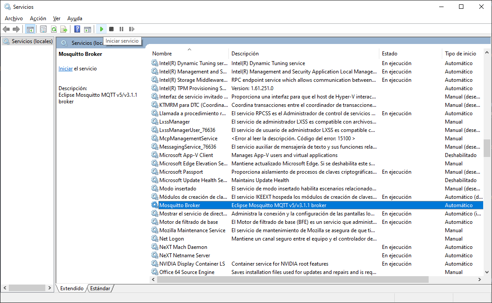
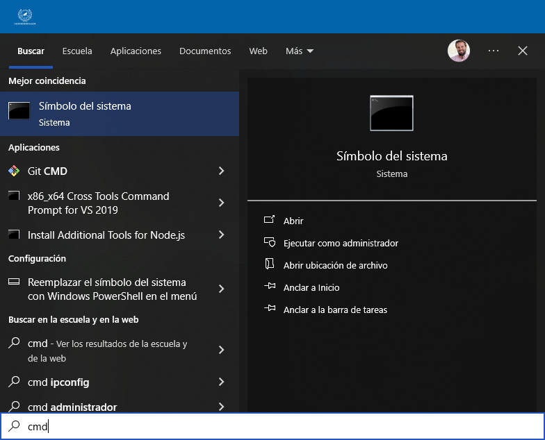
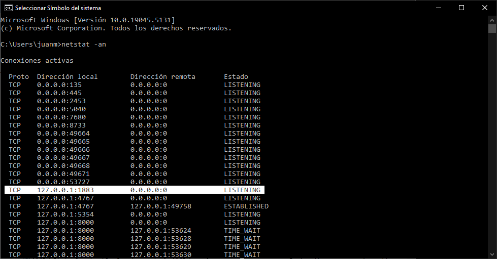
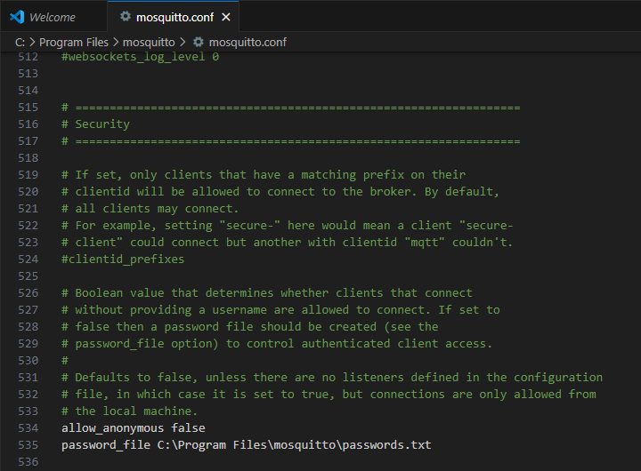

## Introduction

[Eclipse Mosquitto](https://mosquitto.org/) is an Open Source Broker from the Eclipse Foundation distributed under EPL/EDL license that implements MQTT protocol. It is lightweight and is suitable for use on all devices from low power single board computers to full servers. It is programmed in C and is compatible with most OS. The code can be found in [this repo](https://github.com/eclipse/mosquitto).

## Installation

To install mosquitto in Windows, you can follow the next steps.

1. Download the installer from the [official website](https://mosquitto.org/download/). Check the corresponding type of your processor architecture _(most probably 64-bit)_. Once you have the `.exe`, execute it to start the installation process.
2. During the installation, install all the components.



3. When the installer asks you for the Destination Folder, leave the default one (most probably: `C:\Program Files\mosquitto`).



## Start Mosquitto

Now, you can start mosquitto through windows services. You can open the services by clicking the ++windows++ button and typing `Services`. 
[_Here you can check the multiple ways to open windows services_](https://www.digitalcitizen.life/ways-access-services-windows/).


Once you have find the _mosquito broker service_, you can click on _Start the service_ to start and enable the port where the mosquito will start listening for requests.



!!! info  
    It may happen that when you open the windows services, mosquitto is already running.

You can check in the terminal (++windows++ `cmd`) if the service is active and the port enabled with the following command.

```bash
netstat -an
```



Then you will see a list of enabling ports. Port 1883 is the one used by mosquitto for communication.



## Firewall

As mosquitto requires external communication, it is necessary to enable the windows firewall for incoming and outgoing requests on port 1883 (this way, the firewall does not block the mosquitto service).

You need to go to `Control panel > Windows defender firewall`. Then, go yo `advanced setting`.





It will open the Advanced Configuration of Firewall window where you have to look for inbound rules and click on new rule.

1. The first step is to select the type of rule. In this case it is a port, so select it and click on next.
2. Then, you select the rule for `tcp` and we write the corresponding port: `1883`. Click on `next` and allow all the connections.
3. Apply the rule to all the network profiles and place a name to identify it. Click on finish and the rule will be created.

Now you can create the outbound rule. Click on outbound rule and do the same steps you did before.

## Path Environment Variable

Once you have mosquitos running as a service and the firewall is configured, you need to configure the environment variable.

!!! info  
    This is actually not necessary since the programs that use mosquitto will access it through the service. However, if you want to test it with the command console, you will need it.

You need to acced the `environment variables` and search for the variable path to place the route `Control Panel > System and security > System`. Then, open the advanced system configuration and click on `environment variables`.

In the path variable we put the path where mosquitto was installed (remember step 3 of [installation](#installation )`C:\Program Files\mosquitto`), with this the execution files from mosquitto are already recognized from the command console.

## Testing

Now you can test mosquitto broker in your local machine. Open two terminals (++windows++ + `cmd`). Go to the route where mosquitto was installed

```bash
cd C:\Program Files\mosquitto
```

!!! info  
    If you have already configured the variable path, the previous step should not be necessary.

The first terminal will act as a _subscriber_ and will receive the messages published in the topic `/test`.

```bash
mosquitto_sub -h localhost -t /test
```

This command will create a topic called `/test`, which will listen for any call from any _publisher_ that publish in that topic.

The second command terminal will act as a _publisher_ that will publish the message _This is a testing message: Hello, MQTT!_ in the topic `/test`

```bash
mosquitto_pub -h localhost -t test -m "This is a testing message: Hello, MQTT!"
```
