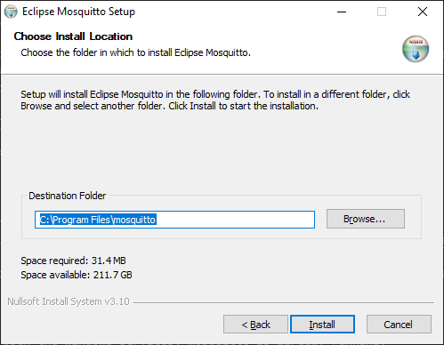
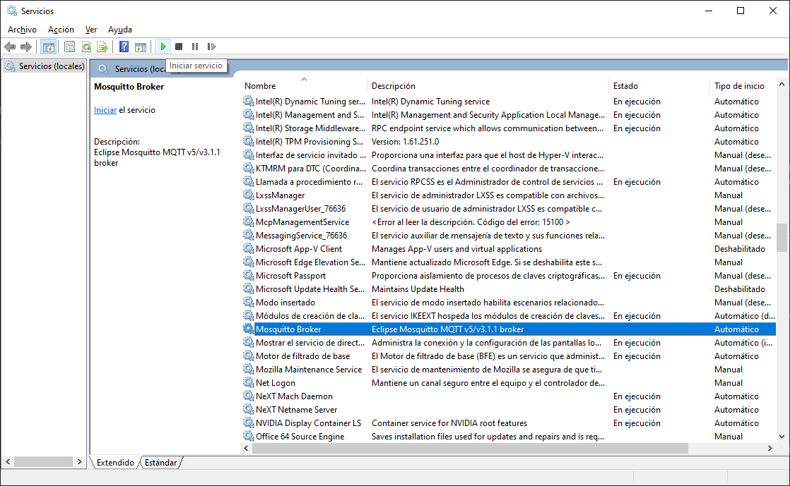

## Introduction

[Eclipse Mosquitto](https://mosquitto.org/) is an Open Source Broker from the Eclipse Foundation distributed under EPL/EDL license that implements MQTT protocol. It is lightweight and is suitable for use on all devices from low power single board computers to full servers. It is programmed in C and is compatible with most OS. The code can be found in [this repo](https://github.com/eclipse/mosquitto).

## Installation

To install Mosquitto, you can follow the next steps.

!!! info  
    "The steps below outline the Mosquitto installation process for Windows. If you are using Ubuntu, the installation process is much easier. You can find the steps for Ubuntu installation [here](https://www.luisllamas.es/como-instalar-mosquitto-el-broker-mqtt/). 

1. Download the installer from the [official website](https://mosquitto.org/download/). Check the corresponding type of your processor architecture _(most probably 64-bit)_. Once you have the `.exe`, execute it to start the installation process.
2. During the installation, install all the components.

{: style="height:300px"}

3. When the installer asks you for the Destination Folder, leave the default one (most probably: `C:\Program Files\mosquitto`).

{: style="height:300px"}

## Start Mosquitto

Now, you can start mosquitto through windows services. You can open the services by clicking the ++windows++ button and typing `Services`. 
[_Here you can check the multiple ways to open windows services_](https://www.digitalcitizen.life/ways-access-services-windows/).

{: style="height:400px"}

Once you have find the _mosquito broker service_, you can click on _Start the service_ to start and enable the port where the mosquito will start listening for requests.



!!! info  
    It may happen that when you open the windows services, mosquitto is already running.

You can check in the terminal (++windows++ `cmd`) if the service is active and the port enabled with the following command.

```bash
netstat -an
```

{: style="height:400px"}

Then you will see a list of enabling ports. Port 1883 is the one used by mosquitto for communication.


## Firewall

As mosquitto requires external communication, it is necessary to enable the windows firewall for incoming and outgoing requests on port 1883 (this way, the firewall does not block the mosquitto service).

You need to go to `Control panel > Windows defender firewall`. Then, go yo `advanced setting`.

{: style="height:400px"}

{: style="height:400px"}

It will open the Advanced Configuration of Firewall window where you have to look for inbound rules and click on new rule.

1. The first step is to select the type of rule. In this case it is a port, so select it and click on next.
2. Then, you select the rule for `tcp` and we write the corresponding port: `1883`. Click on `next` and allow all the connections.
3. Apply the rule to all the network profiles and place a name to identify it. Click on finish and the rule will be created.

Now you can create the outbound rule. Click on outbound rule and do the same steps you did before.

## Path Environment Variable

Once you have Mosquitto running as a service and the firewall is correctly configured, you need to configure the environment variable.

!!! info  
    This is not strictly required but highly recommended. If you don't do this, you can only run Mosquitto commands in the terminal from the root installation folder `C:\Program Files\mosquitto`. If you add this folder to the Path, then you'll be able to run those commands from any location on your system. 

You need to acced the `environment variables` and search for the variable path to place the route `Control Panel > System and security > System`. 

{: style="height:400px"}

Then, open the advanced system configuration and click on `environment variables`.


Include the path where mosquitto was installed (remember step 3 of [installation](#installation )`C:\Program Files\mosquitto`). 

{: style="height:350px"}{: style="height:350px"}

