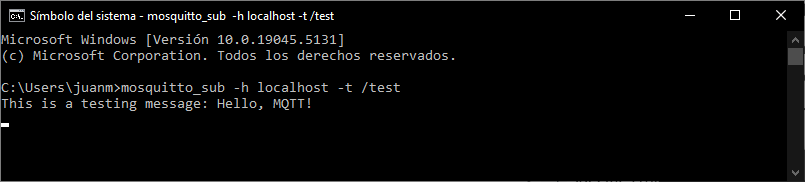
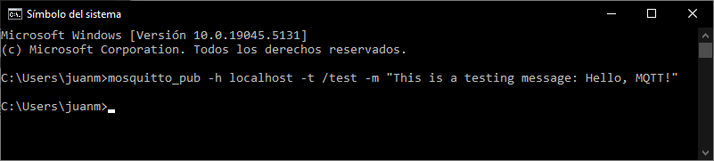

## Testing

If you have already completed [Part 1](./part1_install_mosquitto.md), now you can test mosquitto broker in your local machine. Open one terminal (++windows++ + `cmd`) and go to the route where mosquitto was installed

```
cd C:\Program Files\mosquitto
```

!!! info  
    If you have already configured the variable path in [Part 1](./part1_install_mosquitto.md), the previous step should not be necessary.

### Creating a _subscriber_
This terminal will act as a _subscriber_ and will receive the messages published in the topic `/test`. To do so, run the following command

```bash
mosquitto_sub -h localhost -t /test
```

1. **`mosquitto_sub`**  
    - This is the **Mosquitto client tool** used to subscribe to an MQTT topic.
    - It listens for messages published to specific topics.

2. **`-h localhost`**  
    - `-h` specifies the **host** or **broker address** to connect to.
    - `localhost` means the broker is running on the same machine where the command is being executed. If the broker is on a remote server, you'd need to replace    `localhost` with the server's IP address or domain name.

3. **`-t /test`**  
    - `-t` specifies the **topic** to subscribe to.
    - `/test` is the topic name in this example. Topics are hierarchical strings used by MQTT brokers to route messages. In this case, the client will subscribe to the `/test` topic and receive any messages published to it.

#### Explanation:
The command subscribes to the MQTT topic `/test` on a broker running locally (at `localhost`). Messages sent to the `/test` topic by other MQTT clients or publishers will be received and displayed by this subscriber.


### Creating a _publisher_
 Without closing that terminal, open another one (++windows++ + `cmd`). This second terminal will act as a _publisher_ that will publish the message _This is a testing message: Hello, MQTT!_ in the topic `/test`. This message will be received by the subscriber and will display it in the terminal

```bash
mosquitto_pub -h localhost -t /test -m "This is a testing message: Hello, MQTT!"
```

1. **`mosquitto_pub`**  
    - This is the **Mosquitto client tool** used to publish messages to an MQTT topic.
    - It sends messages to the specified topic on the broker.

2. **`-h localhost`**  
    - `-h` specifies the **host** or **broker address** to connect to.
    - `localhost` means the broker is running on the same machine where the command is being executed. If the broker is on a remote server, you'd replace `localhost` with the server's IP address or domain name.

3. **`-t test`**  
    - `-t` specifies the **topic** to which the message will be published.
    - `test` is the topic name in this example. Other MQTT clients subscribed to this topic will receive the message.

4. **`-m "This is a testing message: Hello, MQTT!"`**  
    - `-m` specifies the **message** to publish.
    - `"This is a testing message: Hello, MQTT!"` is the message content being sent to the `test` topic. Clients subscribed to the topic will see this exact message.

#### Explanation:
The command publishes the message `"This is a testing message: Hello, MQTT!"` to the MQTT topic `test` on a broker running locally (at `localhost`). Any MQTT clients subscribed to the `test` topic will receive this message.

### Expected result

If you have correctly done all the steps, you should have seen the following:



!!! note  
    The subscriber will keep running indefinitely, waiting for messages. On the other hand, the publisher runs only once to send a single message. If you want to send more messages, you will need to re-run the entire command each time

