!!! danger "Connection from an external network"
    This section allows you to connect **external devices within a local network** to the broker that you have created in [Part1](./part1_install_mosquitto.md). When this section talks about IP address, it refers to the *private IP address* (i.e., the one assigned by the router that creates the network and that is only accessible by the devices that are on the network). If you want to work with devices outside the network, you need to work with the *public IP address* (which is unique and visible to everyone). If you would like to configure a broker to allow **connections through the internet from external networks**, you would have to **configure port forwarding on the router** (similarly to what you did in [Part1](./part1_install_mosquitto.md) with the windows firewall). This could pose several **security risks** and would require taking precautions such as using TLS/SSL Encryption or a MQTT Proxy. **This is out of the scope of this course, so it will not be explained here.**


## 1. Allow External Connections

By default, Mosquitto listens only on `localhost`. To allow external connections:

1. Open the **Mosquitto configuration file** (`mosquitto.conf`). The file is typically located in:
    - **Linux**: `/etc/mosquitto/mosquitto.conf`
    - **Windows**: Wherever you installed Mosquitto, e.g., `C:\Program Files\mosquitto\mosquitto.conf`

2. Add or edit the following line to bind Mosquitto to all network interfaces:
    ```
    listener 1883
    ```

    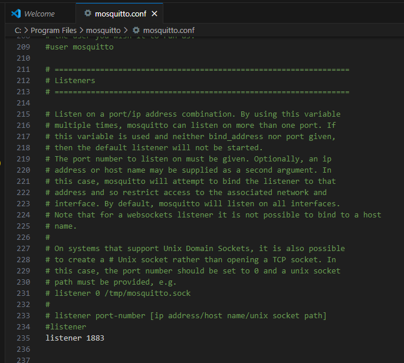{width=500}

    - `1883` is the default MQTT port. If you want a custom port, specify it here.
    - To restrict it to a specific IP, replace `listener 1883` with `listener 1883 <IP Address>`.


3. Restart the Mosquitto service for changes to take effect:
    - **Linux**:
        ```
        sudo systemctl restart mosquitto
        ```
    - **Windows**: Restart Mosquitto from the Windows Services
    

!!! warning
    To edit a file inside `C:\Program Files\mosquitto\`, you'll need administrator rights. To change the `mosquitto.conf`file, you can open it with VSCode (or any other text editor, e.g., notepad or gedit) if you open it as administrator.

    {width=400}


---

## 2. Enable Username and Password Authentication

1. **Create a password file**:  
    - **Linux**:
       
        Use the `mosquitto_passwd` utility to generate the password file:
        ```
        mosquitto_passwd -c /etc/mosquitto/password <username>
        ```
        Replace `<username>` with your desired username. You will be prompted to enter a password.

        Example:
        ```
        mosquitto_passwd -c /etc/mosquitto/password user1
        ```
        `-c` creates a new password file. If you want to add more users later, use:
        ```
        mosquitto_passwd /etc/mosquitto/password <new-username>
        ```

    - **Windows**:

        Use the `mosquitto_passwd` utility to generate the password file:
        ```
        mosquitto_passwd -c C:\Program Files\mosquitto\password <username>
        ```
        Replace `<username>` with your desired username. You will be prompted to enter a password.

        !!! warning
            To edit a file inside `C:\Program Files\mosquitto\`, you'll need administrator rights. If you run the previous command, you'll write in the `C:\Program Files\mosquitto\password` file. To do so, you can open the terminal as administrator.

            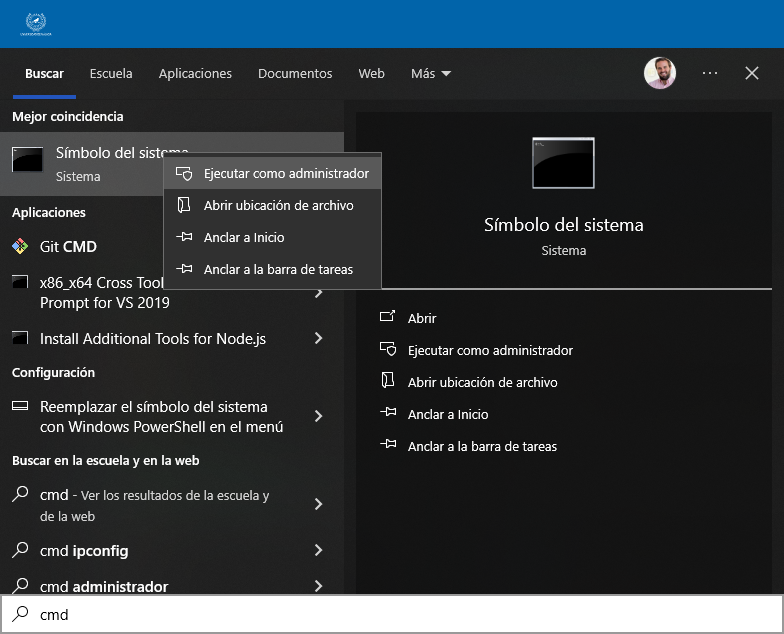{width=400}

        Example:
        ```
        mosquitto_passwd -c C:\Program Files\mosquitto\password user1
        ```

        {width=400}

        `-c` creates a new password file. If you want to add more users later, use:
        
        ```
        mosquitto_passwd C:\Program Files\mosquitto\password <new-username>
        ```

2. **Update the configuration file** to use the password file:

    - **Linux**:
    
        Open `mosquitto.conf` and add or edit the following lines:
        ```
        allow_anonymous false
        password_file /etc/mosquitto/passwords
        ```
    
    - **Windows**:

        Open `mosquitto.conf` and add or edit the following lines:
        ```
        allow_anonymous false
        password_file C:\Program Files\mosquitto\password
        ```

    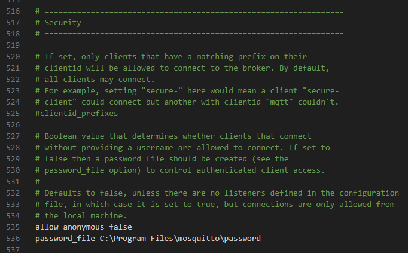{width=500}

3. Restart the Mosquitto service:
    - **Linux**:
        ```
        sudo systemctl restart mosquitto
        ```
    - **Windows**: Restart as mentioned earlier.

!!! warning

    If you receive this error when you try to restart the Mosquitto service

    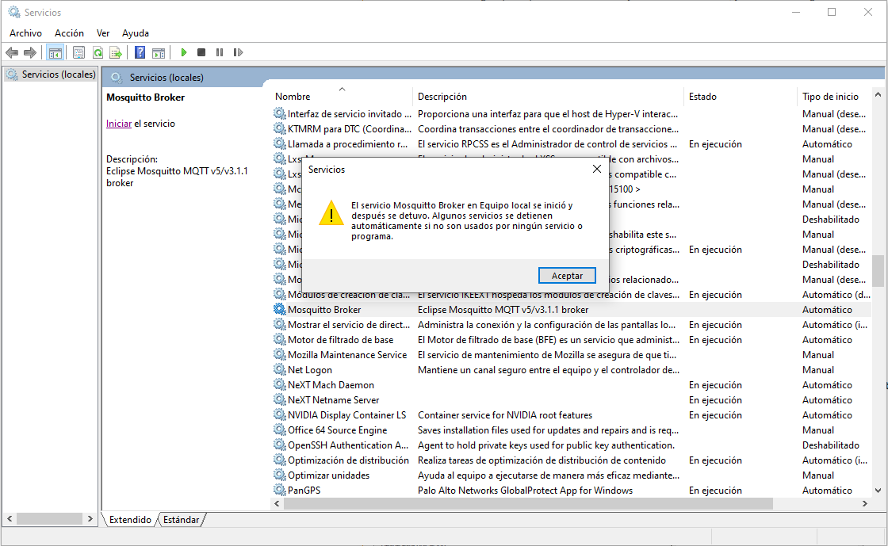{width=500}

    you must change the permissions of the `password` file. 
    
    - Find the password file in `C:/Program Files/mosquitto`, right click > properties and go to the security tab. 
    
    Check if the _SYSTEM_ group has permissions to modify the file. If it does not, you will have to give them as follows. 
    
    - Click on Edit and then on Add.  

    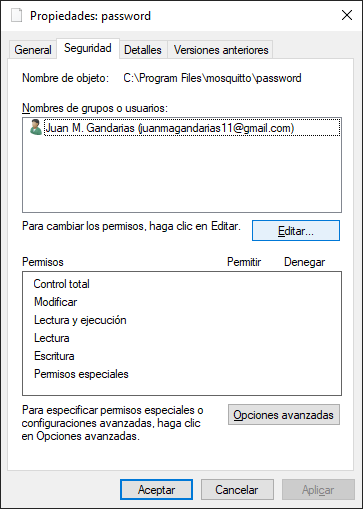{width=300}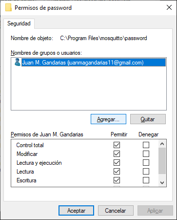{width=300}

    - Add the group SYSTEM and give it permissions to modify the file and click on **apply (this is very important)**.

    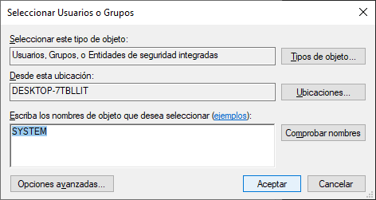{width=400}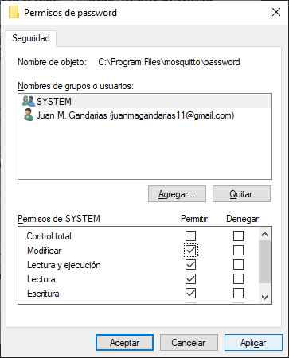{width=300}

    The result should look like this

    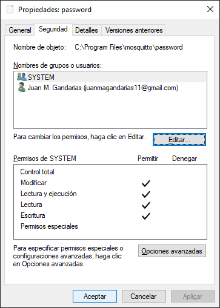{width=300}

---

## 3. Firewall Rules

If Mosquitto is running on a remote machine, make sure the firewall allows connections to the MQTT port (1883 by default).

- **Linux** (using UFW):
    ```
    sudo ufw allow 1883
    ```

- **Windows**: Open "Windows Defender Firewall," and allow inbound traffic for port 1883.

!!! note
    This was already done in [Part 1](./part1_install_mosquitto.md)

---

## 4. Testing External Access

### Testing from a generic MQTT Client (MQTT Explorer)
You can test the connection from a generic MQTT Client like MQTT Explorer.

1. [Install MQTT Explorer](http://mqtt-explorer.com/).
- Check the IP of the broker. Open a terminal and run

    - **Linux**
        ```
        ipconfig
        ```

    - **Windows**: 
        ```
        ifconfig
        ```

    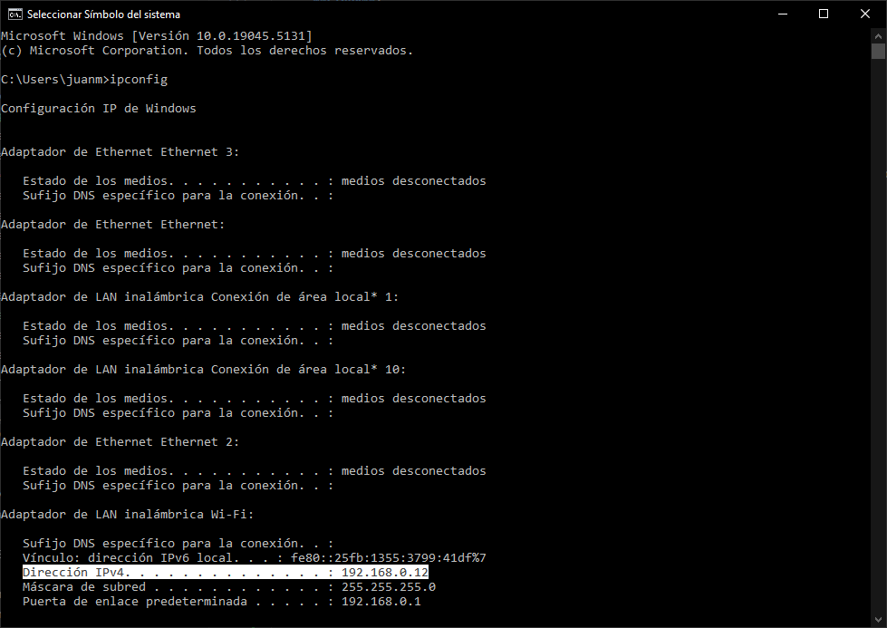{width=600}

    You need to annotate the IPv4 address. In my case: `192.168.0.12`

-  Launch MQTT Explorer and fill the IP, user and password

    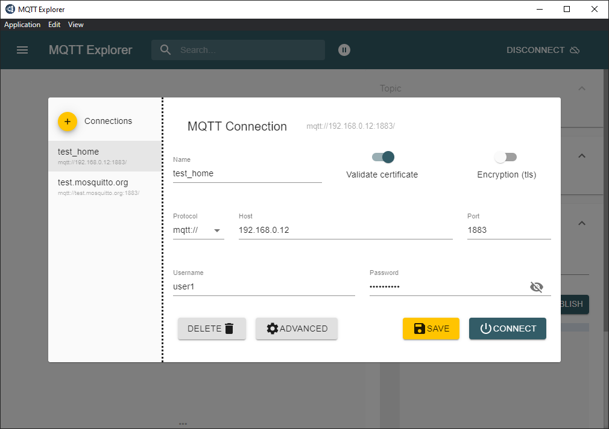{width=500}

- Publish in a topic from MQTT Explorer

    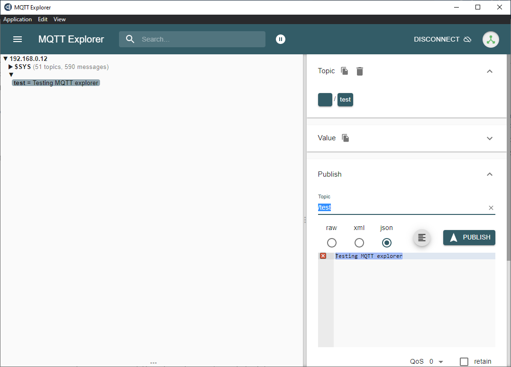{width=500}


### Testing from another PC
You can test the connection from another PC in the network that has installed mosquitto too:

1. **Subscribe** from the **broker device**:
    ```
    mosquitto_sub -h <server-ip> -t test -u <username> -P <password>
    ```

2. **Publish** from an **external device**:
    ```
    mosquitto_pub -h <server-ip> -t test -m "This is a message from an external device: Hello, MQTT!" -u <username> -P <password>
    ```

Replace `<server-ip>` with the server's IP address, `<username>` with your chosen username, and `<password>` with the associated password.


### Testing from an Smartphone

You can test the connection from a Smartphone in the network that has installed mosquitto too:

1. Install [MyMQTT](https://mymqtt.app/en)
- Connect to the broker

    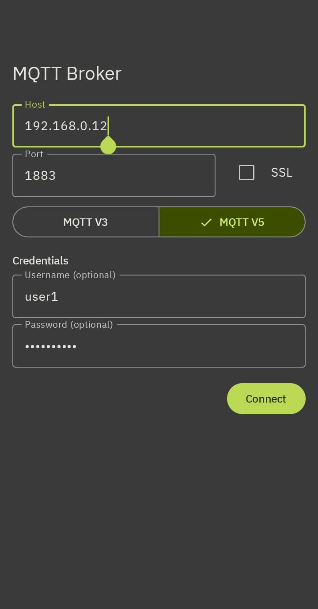{width=300}

- Subscribe to topic `/test` and go to the Dashboard

    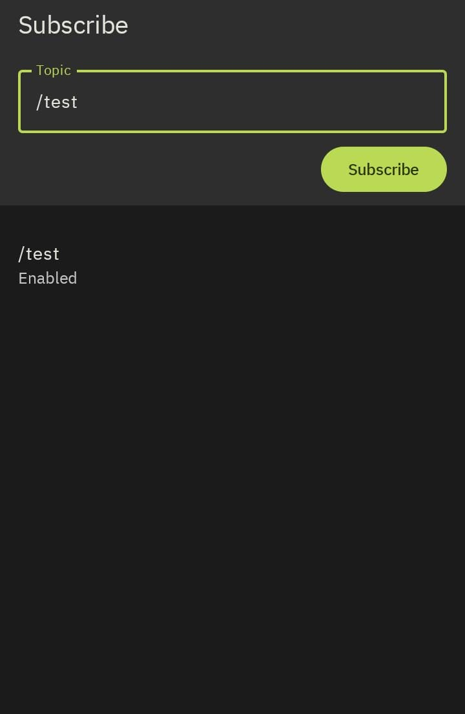{width=300}

- Publish a message in `/test`from another device in the newtork (e.g., from a terminal in your PC) 
    ```
    mosquitto_pub -h <server-ip> -t test -m "This is a message from an external device: Hello, MQTT!" -u <username> -P <password>
    ```
- The message should be visible in the MyMQTT Dashboard

    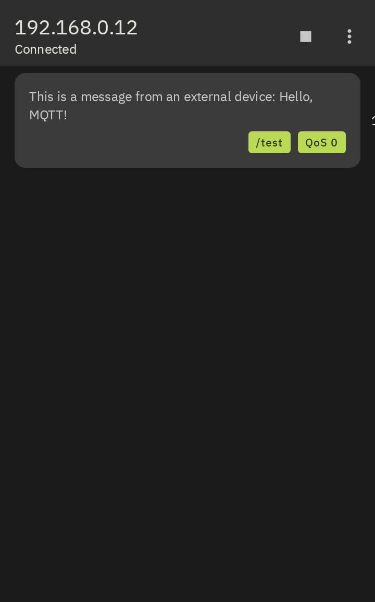{width=300}


---

## Summary of Key Configuration File Changes
```
listener 1883
allow_anonymous false
password_file /etc/mosquitto/passwords.txt
```

After completing these steps, Mosquitto will accept external connections (i.e., from external devices, but in the local network) on port 1883, and only users with valid credentials can publish or subscribe.

!!! success "CONGRATULATIONS!"
    You have created your first MQTT local network and are able to communicate devices in the network using this protocol and to monitor the traffic of the network
