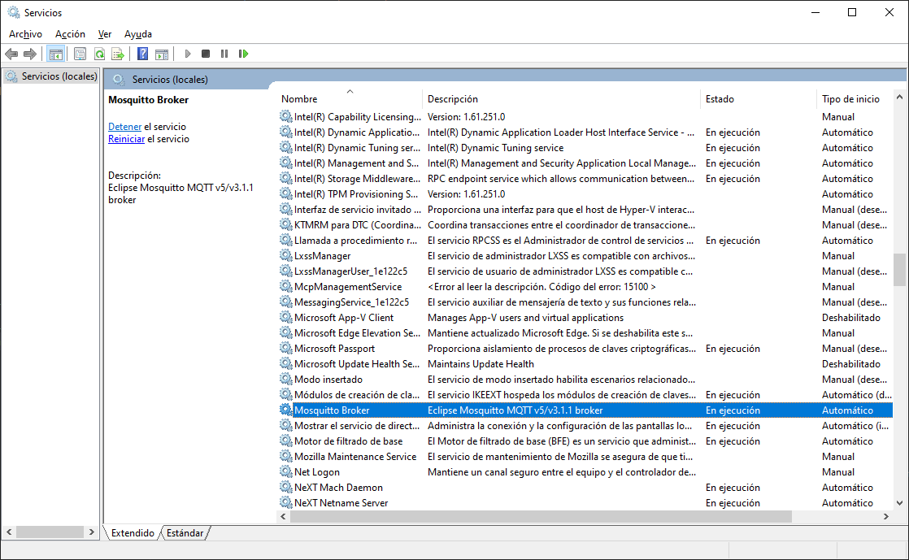
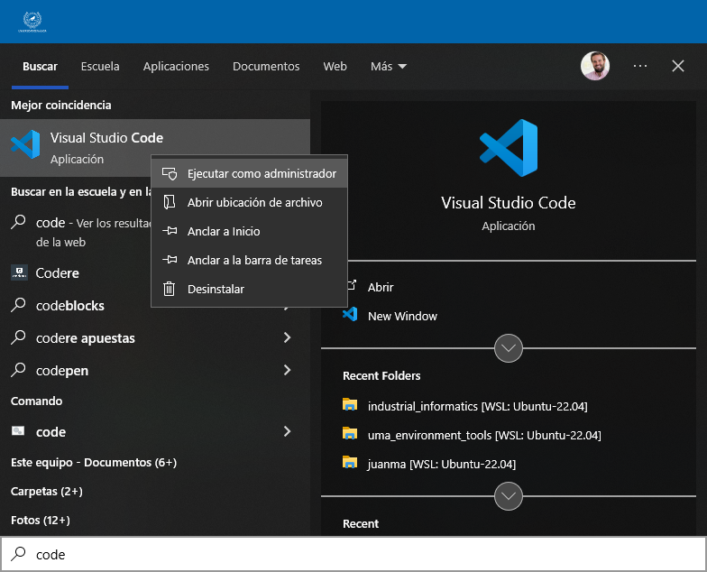

## 1. Allow External Connections

By default, Mosquitto listens only on `localhost`. To allow external connections:

1. Open the **Mosquitto configuration file** (`mosquitto.conf`). The file is typically located in:
    - **Linux**: `/etc/mosquitto/mosquitto.conf`
    - **Windows**: Wherever you installed Mosquitto, e.g., `C:\Program Files\mosquitto\mosquitto.conf`

2. Add or edit the following line to bind Mosquitto to all network interfaces:
    ```
    listener 1883
    ```

    

    - `1883` is the default MQTT port. If you want a custom port, specify it here.
    - To restrict it to a specific IP, replace `listener 1883` with `listener 1883 <IP Address>`.


3. Restart the Mosquitto service for changes to take effect:
    - **Linux**:
        ```
        sudo systemctl restart mosquitto
        ```
    - **Windows**: Restart Mosquitto from the Windows Services
    

!!! warning
    To edit a file inside `C:\Program Files\mosquitto\`, you'll need administrator rights. To change the `mosquitto.conf`file, you can open it with VSCode (or any other) text editor if you open it as administrator.

    

---

## 2. Enable Username and Password Authentication

1. **Create a password file**:  
    - **Linux**:
       
        Use the `mosquitto_passwd` utility to generate the password file:
        ```
        mosquitto_passwd -c /etc/mosquitto/passwords.txt <username>
        ```
        Replace `<username>` with your desired username. You will be prompted to enter a password.

        Example:
        ```
        mosquitto_passwd -c /etc/mosquitto/passwords.txt user1
        ```
        `-c` creates a new password file. If you want to add more users later, use:
        ```
        mosquitto_passwd /etc/mosquitto/passwords.txt <new-username>
        ```

    - **Windows**:

        Use the `mosquitto_passwd` utility to generate the password file:
        ```
        mosquitto_passwd -c C:\Program Files\mosquitto\passwords.txt <username>
        ```
        Replace `<username>` with your desired username. You will be prompted to enter a password.

        !!! warning
            To edit a file inside `C:\Program Files\mosquitto\`, you'll need administrator rights. If you run the previous command, you'll write in the `C:\Program Files\mosquitto\passwords.txt` file. To do so, you can open the terminal as administrator.

            

        Example:
        ```
        mosquitto_passwd -c C:\Program Files\mosquitto\passwords.txt user1
        ```

        

        `-c` creates a new password file. If you want to add more users later, use:
        
        ```
        mosquitto_passwd C:\Program Files\mosquitto\passwords.txt <new-username>
        ```

2. **Update the configuration file** to use the password file:

    - **Linux**:
    
        Open `mosquitto.conf` and add or edit the following lines:
        ```
        allow_anonymous false
        password_file /etc/mosquitto/passwords.txt
        ```
    
    - **Windows**:

        Open `mosquitto.conf` and add or edit the following lines:
        ```
        allow_anonymous false
        password_file C:\Program Files\mosquitto\passwords.txt
        ```

    

3. Restart the Mosquitto service:
    - **Linux**:
        ```
        sudo systemctl restart mosquitto
        ```
    - **Windows**: Restart as mentioned earlier.

---

## 3. Firewall Rules

If Mosquitto is running on a remote machine, make sure the firewall allows connections to the MQTT port (1883 by default).

- **Linux** (using UFW):
    ```
    sudo ufw allow 1883
    ```

- **Windows**: Open "Windows Defender Firewall," and allow inbound traffic for port 1883.

!!! note
    This was already done in [Part 1](./part1_install_mosquitto.md)

---

## 4. Testing External Access

1. **Subscribe** from an external device:
    ```
    mosquitto_sub -h <server-ip> -t test -u <username> -P <password>
    ```

2. **Publish** from an external device:
    ```
    mosquitto_pub -h <server-ip> -t test -m "Hello, MQTT!" -u <username> -P <password>
    ```

Replace `<server-ip>` with the server's IP address, `<username>` with your chosen username, and `<password>` with the associated password.

---

## Summary of Key Configuration File Changes
```
listener 1883
allow_anonymous false
password_file /etc/mosquitto/passwords.txt
```

After completing these steps, Mosquitto will accept external connections on port 1883, and only users with valid credentials can publish or subscribe.
