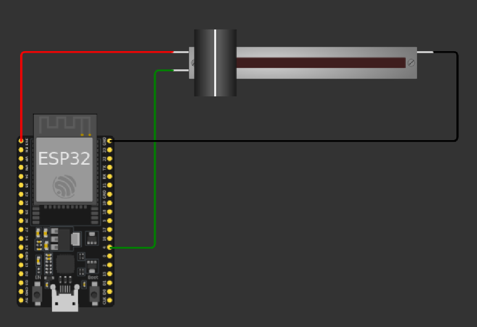

# External data acquisition

## Polling

### Exercise 1: Example of polling programming
Based on the following diagram in which we have a linear potentiometer connected to an ESP32, create a script that publishes the data read from the potentiometer through the serial port with a frequency of 50Hz.

[Download the solution](exercises_solutions/01_example_polling.zip)

### Exercise 2: Problem 1: Data loss
Include a push button and an LED, and modify the script so that each time the button is pressed, the state of the LED changes.

[Download the solution](exercises_solutions/02_problem1_data_loss.zip)

### Exercise 3: Example of interrupt-driven programming
Solution to Problem 1: Hardware interrupts 
Modify the script so that each time the button is pressed, an interrupt is generated, preventing data loss.

[Download the solution](exercises_solutions/03_solution1_interruption.zip)

### Exercise 4:  Problem 2: Loss of timing requirements
Change the button task so that each time it is pressed, an interrupt is generated and the LED blinks 5 times with a period of half a second.

[Download the solution](exercises_solutions/04_problem2_loss_timing_requirements.zip)

### Exercise 5: Example of timer
Solution to Problem 2: Timer interrupts 
Use a timer to make the LED blink with a half-second period and avoid loss of timing requirements.

[Download the solution](exercises_solutions/05_solution2_timers.zip)