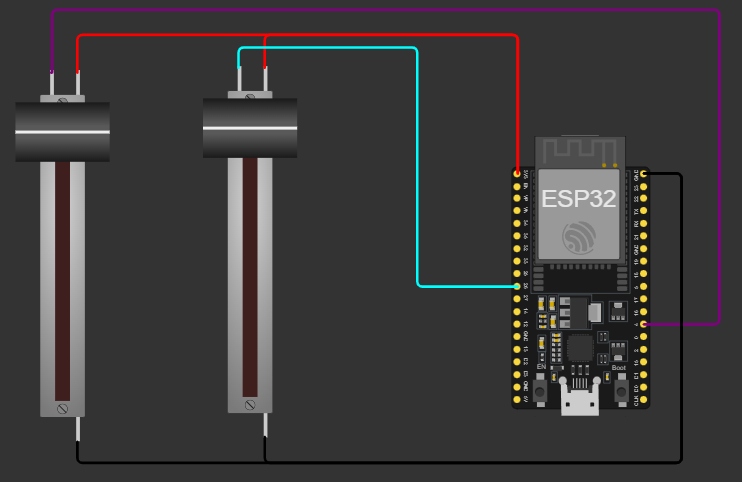
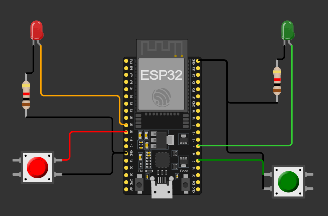

# Introduction to RTOS with embedded systems

## FreeRTOS Instructions

### Task definition
```cpp
TaskHandle_t handle_task_name; 
```

`TaskHandle_t` is a typedef (alias) for a pointer type used by FreeRTOS to reference a task. It’s essentially a handle that uniquely identifies a task within the RTOS scheduler.

`handle_task_name` is the variable name you’re declaring. It will store the handle of a task after you create it.

You usually declare the handle as a global variable

```cpp
BaseType_t xTaskCreatePinnedToCore(
    TaskFunction_t task_function,
    const char * const task_description,
    const uint32_t memory_in_words,  
    void *parameters,
    UBaseType_t task_priority,
    TaskHandle_t *handle_task_name,
    const BaseType_t core_ID     
);
```
- `task_function`: The task function (`void task_function(void *parameters)`). The entry point for the task. It usually contains an infinite loop (`while(1)`).
- `task_description`: Descriptive task name (for debugging). E.g., `"Task 1"`.
- `memory_in_words`: Stack size in words (on ESP32 - 32-bit words, 1 word = 4 bytes). If you think in bytes, divide by 4. Example: 4096 bytes → 4096 / 4 = 1024 words. It depends on what the task does (printf, floating point, deep call chains, libraries, etc.). If the memory is set too high, you'll waste RAM. If the memory is set two low you'll find an error like `***ERROR*** A stack overflow in task task_description has been detected.`
- `parameters`: Pointer passed to the task (or `NULL`). We'll always use `NULL` in the course.
- `task_priority`: Task priority (higher number = higher priority). Guidelines: Keep typical app tasks around 1–5.
Avoid competing with critical system tasks (Wi‑Fi/BLE) unless necessary. Only use very high priority for time-critical loops (e.g., your WNN control loop), and keep them efficient. 
Pitfall: A high-priority task that doesn’t block can [*starve*](https://en.wikipedia.org/wiki/Starvation_(computer_science)) others. Ensure it yields via vTaskDelay, queues, or event groups.
We'll only use priorities 0 or 1.
- `handle_task_name`: Receives the created task’s handle. Use it to later suspend, resume, delete, change affinity (IDF APIs), or query stack.
- `core_ID`: The CPU core the task is pinned to. On ESP32 0 or 1 to select the core. Arduino-ESP32 often runs the loopTask and Wi‑Fi on core 1; pinning your real-time/control task to core 0 can improve determinism.

```cpp
void task_function(void *parameters)
{
  // Local constants/variables for this task (can share names across tasks without interfering)

  // some code...

  while (1) // infinite loop
  {
    // some code...
  }
}
```

#### Minimal example

```cpp

TaskHandle_t HandleTaskName; 

void setup(){
    xTaskCreatePinnedToCore(
        taskFunction,           // Function name that implements the task
        "task description",     // Task description
        2048/4,                 // Memory (in bytes) assigned to this task (don't set too high)
        NULL,                   // Task input parameter (none)
        0,                      // Task priority 0
        &HandleTaskName,        // Handle of the task
        0                       // Core where task 1 will run (this one in core 0)
    );
}

void loop(){
    // empty
}

void taskFunction(void *parameters)
{
    // Local constants/variables for this task (can share names across tasks without interfering)

    // some code...

    while (1) // infinite loop
    {
        // some code...
    }
}
```


### Periodic tasks
```cpp
TickType_t xLastWakeTime;
```

- `TickType_t` is the unsigned integer type FreeRTOS uses for tick counts (system time in ticks). On ESP32 and most 32-bit ports it’s 32‑bit. Each tick is a fixed time quantum defined by the RTOS tick rate.
- `xLastWakeTime` is a variable that stores the reference tick for your task’s last wake-up. You initialize it once before your periodic loop and then pass it by reference to `vTaskDelayUntil()` so FreeRTOS can wake the task at precise intervals (reduces jitter and drift vs. `vTaskDelay()`).

```cpp
const TickType_t xPeriod = period_in_ms / portTICK_PERIOD_MS
```

- `portTICK_PERIOD_MS` is A constant that equals the duration of one tick in milliseconds. It is derived from `configTICK_RATE_HZ`: `portTICK_PERIOD_MS = 1000 / configTICK_RATE_HZ`. E.g., if `configTICK_RATE_HZ = 1000`, then `portTICK_PERIOD_MS = 1 ms` (1 tick = 1 ms). If `configTICK_RATE_HZ = 100`, then `portTICK_PERIOD_MS = 10 ms` (1 tick = 10 ms). By default, 1 tick = 1ms.
- `xPeriod` is the period in ticks that you want the task to run at, computed from a desired period in milliseconds.
- `period_in_ms` is the period in ms (here you can write the period of the task in ms).

In practice, you can use the macro `pdMS_TO_TICKS(period_in_ms)` (preferred), which handles rounding and avoids integer mistakes:

```cpp
const TickType_t xPeriod = pdMS_TO_TICKS(period_in_ms);
```

```cpp
vTaskDelayUntil(&xLastWakeTime, xPeriod);
``` 

- `vTaskDelayUntil(&xLastWakeTime, xPeriod)` is is a FreeRTOS API call used inside a task’s loop to make it run at a fixed, periodic rate with minimal drift. It puts the current task to sleep until the next absolute wake-up time based on `xLastWakeTime` and `xPeriod`. Unlike `vTaskDelay()` (which sleeps relative to “now”), `vTaskDelayUntil()` targets exact tick instants `(t0, t0 + T, t0 + 2T, …)`, keeping a stable cadence even if individual iterations vary slightly in execution time.

#### Minimal example

```cpp

TaskHandle_t HandleTaskName; 

void setup(){
    xTaskCreatePinnedToCore(
        taskFunction,           // Function name that implements the task
        "task description",     // Task description
        2048/4,                 // Memory (in bytes) assigned to this task (don't set too high)
        NULL,                   // Task input parameter (none)
        0,                      // Task priority 0
        &HandleTaskName,        // Handle of the task
        0                       // Core where task 1 will run (this one in core 0)
    );
}

void loop(){
    // empty
}

void taskFunction(void *parameters)
{
    // Local constants/variables for this task (can share names across tasks without interfering)

    const TickType_t xPeriod = pdMS_TO_TICKS(10);  // 10 ms period
    TickType_t xLastWakeTime = xTaskGetTickCount();  // initialize once

    // some code...

    while (1) // infinite loop
    {
        // some code...

        // Sleep until the next absolute release time (no drift)
        vTaskDelayUntil(&xLastWakeTime, xPeriod);
    }
}
```

## Exercises

### Exercise 8: Multicore app reading from two analog sensors

Read from two analog sensors using both cores of the ESP32 (one sensor per core). One sensor is read at 1Hz, and the other at 2Hz.



Download the solution [here](exercises_solution/08_multicore.zip)

### Exercise 9: Simple multicore app with two buttons and two LEDs

Use one core to handle the red button and red LED, and the other core to handle the green button and green LED. 
One the button is pressed, the LED changes its state.



Download the solution [here](exercises_solution/09_multicore_ISR_simple.zip)

### Exercise 10: Multicore app with two buttons and two LEDs, and periodic tasks

With the same diagram as in exercise 9, when the red button is pressed, the red LED blinks at 3Hz. When the green button is pressed, the green LED blinks at 2Hz. When a button is pressed again, its corresponding LED turns off.

Download the solution [here](exercises_solution/10_multicore_ISR_complex.zip)
